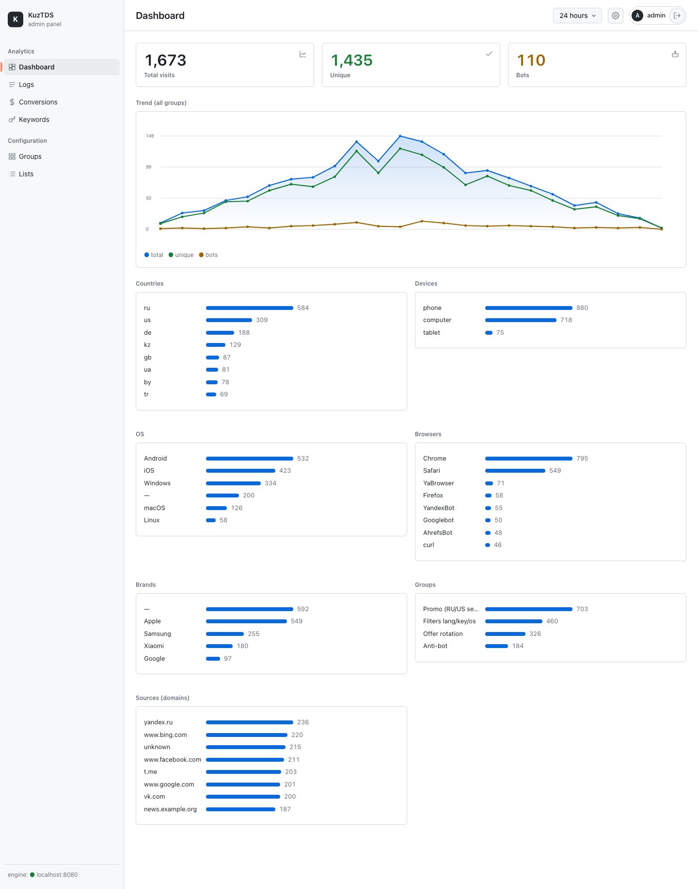
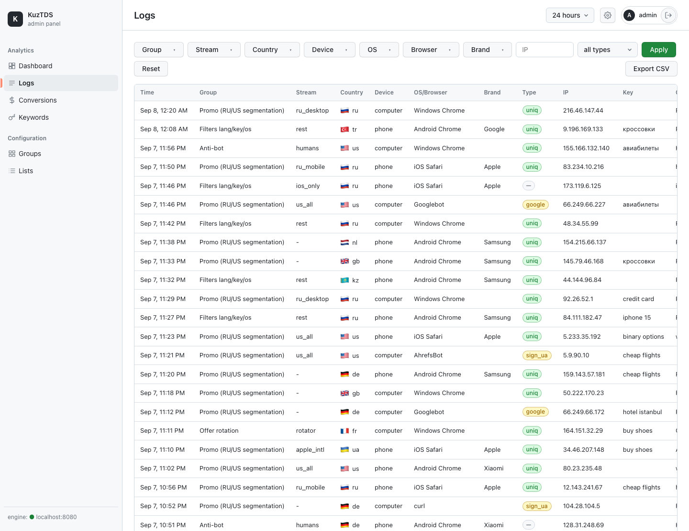
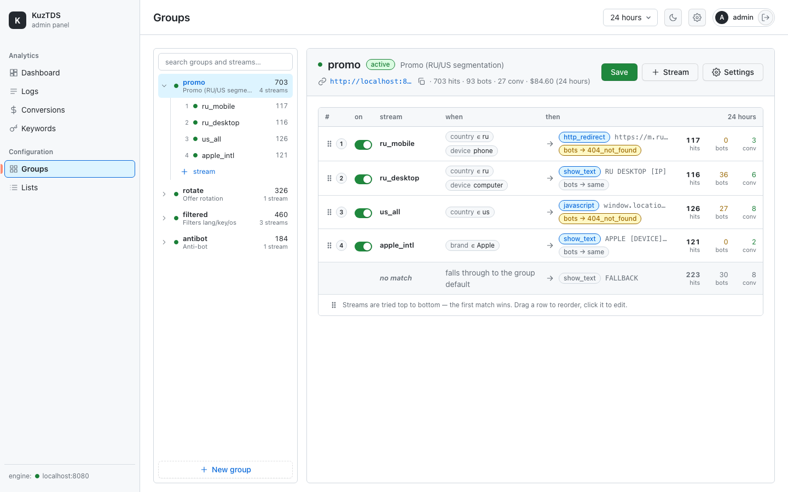

**English** · [Русский](README.ru.md)

# KuzTDS

**A fast, secure, self-hosted Traffic Distribution System (TDS) written in Go.**

KuzTDS takes an incoming visitor, decides **by rules** where to send them
(redirect / iframe / JavaScript / inline content / stub), tells **bots apart from
humans**, and records everything for analytics — all from a single long-running
binary with an embedded admin panel.

It is built for throughput and safety: IP lists and signatures live in memory
(`O(log n)` lookups), logs and conversions go to **ClickHouse**, counters and
sessions go to **Redis**, and the hot path never blocks on disk I/O.



---

## Table of contents

- [Why KuzTDS](#why-kuztds)
- [Features](#features)
- [Screenshots](#screenshots)
- [Architecture](#architecture)
- [Performance](#performance)
- [Quick start](#quick-start)
- [Configuration](#configuration)
- [Core concepts](#core-concepts)
- [Filters and flag semantics](#filters-and-flag-semantics)
- [Output: redirect types & macros](#output-redirect-types--macros)
- [Bot detection](#bot-detection)
- [Postback & API mode](#postback--api-mode)
- [Admin web interface](#admin-web-interface)
- [HTTP endpoints](#http-endpoints)
- [Testing](#testing)
- [Project layout](#project-layout)
- [Security](#security)
- [Roadmap](#roadmap)
- [License](#license)

---

## Why KuzTDS

A TDS sits in front of your offers/landings and routes each click to the right
place based on who the visitor is. KuzTDS is:

- **Fast** — one process, in-memory indexes, async logging. No per-request file
  reads, no per-request database scans.
- **Safe** — argon2id passwords, server-side sessions, CSRF, parameterized
  queries, trusted-proxy handling for `X-Forwarded-For`, JSON-only input.
- **Self-contained** — the admin panel (SPA) is embedded into the `admin` binary
  via `go:embed`. No Node build step, no external web server required.
- **Operable** — ClickHouse and Redis are **optional**: without them the engine
  still runs and simply skips the corresponding checks (logging, counters).

---

## Features

**Traffic segmentation (per stream):**
- Geo: country / city / region (MaxMind `.mmdb` or Cloudflare `CF-IPCountry`).
- Device: computer / phone / tablet.
- OS, browser (+ versions), device brand (Apple, Samsung, Xiaomi, …).
- WAP carrier (operator) by IP ranges from `wap.dat`.
- Language, referer, domain, keyword (`?q=`), and arbitrary IP lists.
- Yandex.Browser, uniqueness, referer presence.
- Weekly schedule (per day of week).
- Per-stream impression limits (per day / per rolling window).

**Bot handling:**
- UA/referer signatures, search-engine IP lists (Google/Bing/Yandex/Yahoo/Mail/
  Baidu/Others), empty UA/referer/language, IPv6, reverse DNS (PTR), UA blacklist.
- Bots are detected **after** stream selection (per the chosen stream's toggles).
- Optional separate output for bots (`bot_redirect`), or `skip` to serve them the
  normal stream while still logging them.
- `save_ip`: append a detected search-engine IP back into its list.

**Output & rendering:**
- 16 redirect types (HTTP redirect, JS, meta refresh, iframe, inline HTML, error
  pages, JSON API responses, stub, …).
- A rich macro set: `[KEY] [IP] [COUNTRY] [CITY] [REGION] [LANG] [DEVICE]
  [OPERATOR] [DOMAIN] [USERAGENT] [CID] [PAR-1..5] [()COUNTRY()] [()CITY()]
  [RANDNUM-a-b] [RANDSTR-(set)-n] [RANDLINE-(file)-n] [RANDDFL-(dir)-n]`.
- Output-variant distribution with `|||`: `random` / `rotator` (cookie) /
  `evenly` (Redis counter).
- `chance` (show with probability), `separation` (swap output by keyword from a
  `.dat`), `[REMOTE]` (fetch external content with caching), CURL redirect
  (fetch + find/replace), `api_mac` (mac code in API responses).

**Uniqueness & protection:**
- Uniqueness by IP (Redis) or by cookie (dedicated cookie, correct TTL).
- Anti-flood (max requests per IP per window).
- Login rate-limit (Redis sliding window).

**Analytics & admin:**
- Dashboard with a time chart and breakdowns (country/device/OS/browser/brand/
  group/source).
- Logs with multi-select filters loaded from real data, IP search, CSV export,
  and country flags.
- Conversions (postbacks), collected keywords, group/stream form builder, `.dat`
  list editor, password change.

---

## Screenshots

**Logs** — multi-select filters (values loaded from the data for the selected
period), in-list search, country flags, CSV export, pagination:



**Groups & streams** — collapsible group tree, stream form builder with tabs,
live links the engine serves, and stream focus on click:



---

## Architecture

Three binaries, shared `internal/` packages:

| Binary | Port | Purpose |
|--------|------|---------|
| `cmd/engine` | `:8080` | The hot path — traffic handling. A long-running process. |
| `cmd/admin` | `:8090` | REST API + embedded admin SPA (`internal/admin/web`, `go:embed`). |
| `cmd/apiclient` | `:9090` | Client to install on a landing/donor page (calls the engine via `?api=`). |

**Request lifecycle in the engine:**

```
HTTP request
  │
  ├─ postback?  (?pb=KEY&cid=&profit=) → record conversion, exit
  ├─ realip middleware  (trust XFF/CF only from trusted_proxies)
  ├─ api mode?  (?api=base64(JSON), checks KUZTDS_API_KEY)
  ├─ IP blacklist        → 403 if listed
  ├─ resolve group by id/alias (first path segment); none → "trash" mode
  ├─ anti-flood (Redis): N requests / IP / window
  ├─ detect device/OS/browser/brand ; geo (mmdb / CF-IPCountry) ; carrier (wap)
  ├─ uniqueness: cookie | Redis SETNX
  ├─ router.Select(group, visitor)  → first stream that passes all filters
  ├─ bot detection by the SELECTED stream's toggles → bot_redirect (or skip)
  ├─ separation · [REMOTE] · chance · distribution (|||) · api_mac
  ├─ render: macros + redirect type (CURL = fetch+find/replace; api = JSON)
  ├─ collect keywords (save_keys / keys_se)
  └─ async batch log → ClickHouse  (the response never waits for the write)
```

Key principles: **state lives in process memory** (IP indexes, config,
signatures, geo) and is refreshed in the background; **rules are data** (a list of
predicates evaluated in a loop); indexes are swapped **atomically** on hot-reload.
Full details: [`docs/ARCHITECTURE.md`](docs/ARCHITECTURE.md).

---

## Performance

Measured on a **base Apple M1** (4 performance + 4 efficiency cores, 8 GB RAM),
macOS 15, Go 1.26 — with the **engine, ClickHouse, Redis, and the load generator
all running on the same laptop**. They compete for the same 8 cores, so these are
deliberately conservative "everything on one machine" numbers; a dedicated load
host and separate database hosts would push them higher.

The load generator sends requests with varied client IPs (`X-Forwarded-For`), a
mobile User-Agent, and `CF-IPCountry: RU`; redirects are **not** followed, so the
engine's own response is what's measured. Every scenario runs the **full request
pipeline** (real-IP resolution → blacklist → geo → device/OS/browser/brand detect
→ uniqueness → stream routing → bot toggles → macro rendering). Logging to
ClickHouse is asynchronous and never blocks the response.

| Scenario | Requests/sec | p50 | p99 | Errors |
|---|--:|--:|--:|--:|
| **Full pipeline** · cookie uniqueness · async log → ClickHouse (302) | **~30,000** | ~1 ms | ~11 ms | 0 |
| Uniqueness by IP · Redis `SETNX` on every request (200) | ~16,000 | ~2.6 ms | ~10 ms | 0 |
| Active bot detection · search-engine IP lists + signatures (200) | ~13,000 | ~3 ms | ~16 ms | 0 |

Throughput stays flat (~30k req/s) and **error-free** as concurrency rises from 25
to 400 — latency grows but nothing drops. The hot path is allocation-light: the
core CIDR/IP-range lookup runs in **~9 ns/op with 0 allocations**
(`go test -bench=Lookup ./internal/ipindex` → ~130M lookups/sec on a single core).

> Throughput differences between rows come purely from how much work each path
> adds (a Redis round-trip per request, or several IP-list lookups for bots). On
> server-class hardware with the databases on separate hosts, expect materially
> higher numbers.

---

## Quick start

### Prerequisites
- Go (1.25+), Docker (for ClickHouse + Redis).

```bash
brew install go docker
```

### 1. Clone & start infrastructure
```bash
git clone https://github.com/egerkuzma/kuztds.git
cd kuztds
make infra-up          # ClickHouse + Redis via docker compose; schema auto-applied
```

### 2. Generate an admin password hash
```bash
go run ./cmd/admin -hash 'my-strong-password'   # prints $argon2id$...
```

### 3. Run the engine (`:8080`)
```bash
KUZTDS_DATA_DIR=./data \
KUZTDS_GROUPS_FILE=configs/groups.example.json \
KUZTDS_TRUSTED_PROXIES=127.0.0.1/32 \
KUZTDS_POSTBACK_KEY=secret KUZTDS_API_KEY=apikey \
KUZTDS_REDIS_ADDR=localhost:6379 \
KUZTDS_CLICKHOUSE_ADDR=localhost:9000 KUZTDS_CLICKHOUSE_DB=kuztds \
KUZTDS_CLICKHOUSE_USER=kuztds KUZTDS_CLICKHOUSE_PASSWORD=devpassword \
go run ./cmd/engine
```

### 4. Run the admin panel (`:8090`)
```bash
KUZTDS_ADMIN_PASSWORD_HASH='<hash-from-step-2>' \
KUZTDS_ADMIN_PASSWORD_FILE=./admin.hash \
KUZTDS_ADMIN_COOKIE_SECURE=false \
KUZTDS_ENGINE_URL=http://localhost:8080 \
KUZTDS_GROUPS_FILE=configs/groups.example.json \
KUZTDS_DATA_DIR=./data KUZTDS_KEYS_DIR=./keys \
KUZTDS_REDIS_ADDR=localhost:6379 \
KUZTDS_CLICKHOUSE_ADDR=localhost:9000 KUZTDS_CLICKHOUSE_DB=kuztds \
KUZTDS_CLICKHOUSE_USER=kuztds KUZTDS_CLICKHOUSE_PASSWORD=devpassword \
go run ./cmd/admin
```

Open **http://localhost:8090** and log in with `admin` and your password.

### 5. Send a test request to the engine
```bash
curl -i 'http://localhost:8080/promo?q=hello' \
  -H 'X-Forwarded-For: 8.8.8.8' \
  -H 'User-Agent: Mozilla/5.0 (iPhone; CPU iPhone OS 16_0 like Mac OS X) Safari/604.1' \
  -H 'CF-IPCountry: US'
```
Diagnostic response headers show the decision: `X-Kuztds-Stream`, `X-Kuztds-Bot`,
`X-Kuztds-Country`, `X-Kuztds-Device`, `X-Kuztds-Uniq`.

> A `Makefile` is provided: `make build`, `make test`, `make bench`,
> `make infra-up`, `make infra-down`.

---

## Configuration

Everything is configured via `KUZTDS_*` environment variables; **secrets are never
written to files in the repo**. Full reference: [`docs/USAGE.md`](docs/USAGE.md).

### Engine (most-used)
| Variable | Purpose |
|----------|---------|
| `KUZTDS_LISTEN` | listen address (default `:8080`) |
| `KUZTDS_DATA_DIR` | directory of `.dat` lists (IP, wap, signatures, separation) |
| `KUZTDS_GROUPS_FILE` | JSON groups config (source of truth) |
| `KUZTDS_TRUSTED_PROXIES` | trusted proxy CIDRs for `XFF`/`CF` (comma-separated) |
| `KUZTDS_GEO_DB` | path to a MaxMind `.mmdb` (optional; else `CF-IPCountry`) |
| `KUZTDS_REDIS_ADDR` / `_PASSWORD` | Redis (uniq/limit/firewall) |
| `KUZTDS_CLICKHOUSE_ADDR` / `_DB` / `_USER` / `_PASSWORD` | ClickHouse (logs) |
| `KUZTDS_POSTBACK_KEY` | key for the `?pb=` postback |
| `KUZTDS_API_KEY` | key for the `?api=` client mode |
| `KUZTDS_KEYS_DIR` | directory for collected keywords |
| `KUZTDS_TRASH_MODE` / `_URL` | behaviour for an unknown group (0=200,1=redirect,2=403,3=404) |

### Admin (most-used)
| Variable | Purpose |
|----------|---------|
| `KUZTDS_ADMIN_LISTEN` | address (default `:8090`) |
| `KUZTDS_ADMIN_USER` | login (default `admin`) |
| `KUZTDS_ADMIN_PASSWORD_HASH` | argon2id hash |
| `KUZTDS_ADMIN_PASSWORD_FILE` | hash file (takes priority; UI password changes are written here) |
| `KUZTDS_ENGINE_URL` | engine base URL (for group links in the UI) |
| `KUZTDS_GROUPS_FILE` / `KUZTDS_DATA_DIR` / `KUZTDS_KEYS_DIR` | same paths as the engine |

### Groups config (JSON)
A group is reachable at `/<id>` (and at each alias). Example shape:

```json
[
  {
    "id": "promo",
    "name": "Promo (RU/US segmentation)",
    "status": true,
    "redirect": "show_text",
    "out": "FALLBACK",
    "uniq_method": "cookie",
    "uniq_seconds": 86400,
    "firewall": { "enabled": false, "queries": 100, "seconds": 60 },
    "save_keys": true,
    "aliases": ["ru"],
    "streams": [
      {
        "name": "ru_mobile",
        "status": true,
        "rules": { "country": { "flag": 2, "values": ["ru"] }, "computer": 1, "tablet": 1 },
        "out": { "redirect": "http_redirect", "out": "https://m.example.com/?k=[KEY]&c=[COUNTRY]" },
        "bots": { "ch_ua": true, "ch_empty_ua": true, "ch_bot_ip_google": true, "redirect": "404_not_found" }
      },
      { "name": "default", "status": true, "out": { "redirect": "show_text", "out": "no offer" } }
    ]
  }
]
```

You normally **edit groups in the admin UI** ("Groups" → form builder → "Save
all"); the engine caches groups at startup and reloads them on its reload
interval. See `configs/groups.example.json` and `configs/test_groups.json`.

---

## Core concepts

- **Group** — a routing target reachable at `/<id>`. It holds defaults
  (`redirect`/`out`/`header`), uniqueness/firewall settings, and a list of
  **streams**.
- **Stream** — a set of **rules** (predicates) plus an **output**. The router
  picks the **first active stream that passes all of its rules**; order matters.
- **Rules are data** — each filter is a value with a flag; the router evaluates
  them in a loop. If no stream matches, the group defaults / `trash` mode apply.
- **Trash mode** — what to return for an unknown/disabled group: `200` empty,
  redirect, `403`, or `404`.

---

## Filters and flag semantics

Most list filters use a three-state flag (the zero value is "off", so unset
filters never block traffic):

| Flag | Meaning (list filters) | Meaning (device/operator) |
|:----:|------------------------|---------------------------|
| `0` | **off** — filter not applied | — |
| `1` | **exclude** — reject on match (blacklist) | block this device/operator |
| `2` | **include** — reject on absence of a match (whitelist) | require (whitelist) |

In the UI these read **off / exclude / include**. `lang`/`country` use
"contains" semantics; `city`/`region`/`brand` use exact match; `ua`/`referer`/
`key` accept `/regex/` or a substring; `os`/`browser` match over `"name version"`.

---

## Output: redirect types & macros

**Redirect types** (`out.redirect`):

| Type | Result |
|------|--------|
| `http_redirect` | `302` with `Location: <out>` |
| `meta_refresh`, `js_redirect`, `iframe_redirect`, `iframe_selection`, `js_selection` | HTML that navigates the browser |
| `javascript` | `200` JS body |
| `show_text` | `200` plain text |
| `show_page_html` | `200` HTML page wrapping `<out>` |
| `under_construction` | `200` stub page |
| `stop` | `200`, empty body |
| `403_forbidden`, `404_not_found`, `500_server_error` | error pages |
| `api` | `200` JSON `{out,type,country,device,…}` (for api clients) |
| `show_out` | `200` JSON `{out,type:1,mac}` |
| `curl` | fetch a URL server-side, apply find/replace, return the body |

**Macros** (expanded in `out`):

`[KEY]` (url-encoded keyword) · `[PATH]` (host) · `[IP]` · `[COUNTRY]` `[CITY]`
`[REGION]` · `[LANG]` · `[DEVICE]` · `[OPERATOR]` · `[DOMAIN]` · `[USERAGENT]` ·
`[CID]` (click id, for postbacks) · `[PAR-1..5]` (extra GET params) ·
`[()COUNTRY()]` `[()CITY()]` · `[RANDNUM-a-b]` · `[RANDSTR-(charset)-n]` ·
`[RANDLINE-(file)-n[/u]]` · `[RANDDFL-(dir)-n[/u]]`.

**Distribution** — put several variants in `out` separated by `|||` and choose
`distribution`: `random`, `rotator` (sticky per cookie), or `evenly` (Redis
counter, round-robin).

---

## Bot detection

Per stream, toggle which checks apply (tab **Bots** in the editor): UA/referer
signatures, empty UA/referer/language, IPv6, PTR (reverse DNS), UA blacklist, and
search-engine IP lists. Detection runs **after** stream selection. Then:

- `redirect: "skip"` (or empty) — serve the normal stream output, but still log
  the visitor as a bot.
- `redirect: "404_not_found"` (or any redirect type) + optional `out`/`header` —
  serve bots a **separate** output (`bot_redirect`).
- `save_ip: true` — append a detected search-engine IP back into its `.dat` list.

---

## Postback & API mode

**Postback (conversion tracking).** Put a click id into your offer URL via the
`[CID]` macro, then have the offer call back:

```
http://your-host/?pb=YOUR_POSTBACK_KEY&cid=[CID]&profit=1.50
```
The engine finds the original event by `cid` and records the conversion (visible
under **Conversions**).

**API mode.** A landing page can ask the engine for a decision without redirecting
the visitor itself: send `?api=base64(JSON)` (authenticated with `KUZTDS_API_KEY`)
containing the visitor data; the engine returns a JSON decision. `cmd/apiclient`
is a ready-made client that collects visitor data, calls the engine, and applies
the result (redirect or content).

---

## Admin web interface

A single embedded SPA (dark theme, English UI). Layout: **left sidebar**
navigation, **top-right** period picker, settings gear, user, and log-out.

- **Dashboard** — visits / unique / bots cards, a time chart, and breakdowns by
  country, device, OS, browser, brand, group and source.
- **Logs** — multi-select filters (group/stream/country/device/OS/browser/brand)
  whose values are loaded from the data for the selected period, in-list search,
  IP field, humans/bots toggle, country flags, pagination, CSV export.
- **Conversions** — postbacks and total profit for a period.
- **Keywords** — collected keywords per group/date.
- **Groups** — collapsible group→stream tree; a stream form builder with tabs
  (Main · Devices · WAP · Geo · Filters · UA/OS/Brand · Schedule · Limit · Bots ·
  Remote · API); clicking a stream scrolls to and highlights its form.
- **Lists** — editor for `.dat` files (IP bases, WAP operators, signatures).
- **Settings** (gear) — change the admin password.

---

## HTTP endpoints

**Engine:**
- `GET /<id>` — serve a group (optionally `?q=<keyword>`, `?p1=..&p2=..`).
- `GET /?pb=KEY&cid=..&profit=..` — postback pixel.
- `GET /?api=base64(JSON)` — api-client mode.
- `GET /healthz` — health probe.

**Admin API** (session + CSRF protected): `POST /api/login`, `POST /api/logout`,
`GET /api/me`, `POST /api/password`, `GET /api/stats/{summary,timeseries,
breakdown}`, `GET /api/logs`, `GET /api/logs/filters`, `GET /api/logs/export`,
`DELETE /api/logs`, `GET /api/postbacks`, `GET /api/keys`,
`GET|PUT /api/groups`, `GET /api/lists`, `GET|PUT /api/lists/{name}`.

---

## Testing

```bash
go test ./...                              # unit tests (14 packages)
go test -tags=integration ./...            # + ClickHouse/Redis round-trips (needs make infra-up)
go test -tags=uitest ./internal/admin/     # checks the embedded SPA's JS parses (needs node)
go vet ./...
make bench                                 # ipindex benchmark (~10 ns/lookup)
```

Highlights: `cmd/engine/e2e_test.go` drives **23 end-to-end scenarios** through
the full pipeline (all redirect types, all macros, bots, geo, filters, operators,
distribution, limits, firewall, separation, schedule, chance, api mode, and a
traffic matrix). ClickHouse tests are behind the `integration` build tag and skip
automatically when ClickHouse is unavailable. Coverage snapshot:
[`docs/STATUS.md`](docs/STATUS.md).

---

## Project layout

```
cmd/
  engine/       hot path (traffic handling)
  admin/        REST API + embedded SPA
  apiclient/    landing/donor client
internal/
  ipindex/      CIDR index O(log n) + list manager with hot-reload
  config/       group/stream model + JSON loader
  geo/          MMDB (MaxMind) / Nop resolver
  detect/       device + OS/browser/brand + bots, signatures
  router/       stream selection (predicates)
  render/       output macros + all redirect types
  fetch/        HTTP client with TTL cache ([REMOTE], CURL)
  store/        ClickHouse (logs/postbacks/stats) + Redis (counters/sessions)
  logbuf/       async event buffer → batch insert
  security/     argon2id, sessions, CSRF, constant-time
  server/       realip middleware (trusted proxies)
  admin/        HTTP handlers, file stores, embedded SPA (web/index.html)
migrations/clickhouse/   schema (auto-applied by make infra-up)
deploy/docker-compose.yml ClickHouse + Redis for local dev
configs/                 example & test group configs
docs/                    USAGE / ARCHITECTURE / SECURITY / STATUS (+ *.ru.md)
```

---

## Security

argon2id passwords · server-side sessions · CSRF on unsafe methods · login
rate-limit · trusted-proxy XFF handling · parameterized ClickHouse queries ·
strict `.dat` filename validation (no path traversal) · JSON-only input · secrets
via env only. Full model: [`docs/SECURITY.md`](docs/SECURITY.md).

---

## Roadmap

Planned: a cron service (bot IP-list updates, VirusTotal domain checks, disk
monitoring + Telegram alerts), more geo filters (ASN/organization/timezone),
Telegram conversion notifications, and more. See [`TODO.md`](TODO.md).

---

## License

[MIT](LICENSE).
