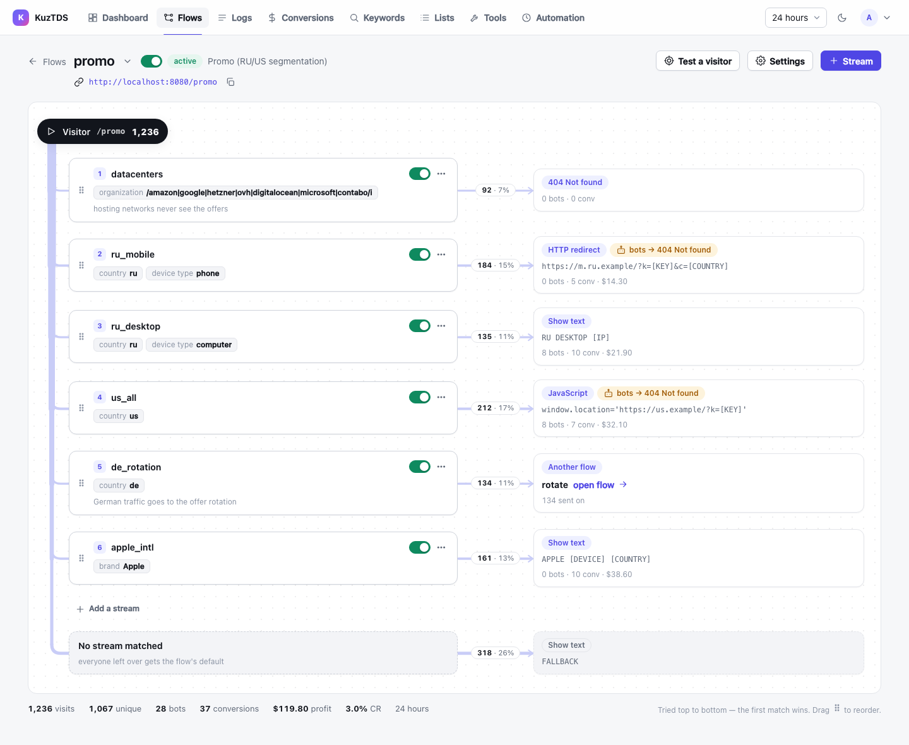
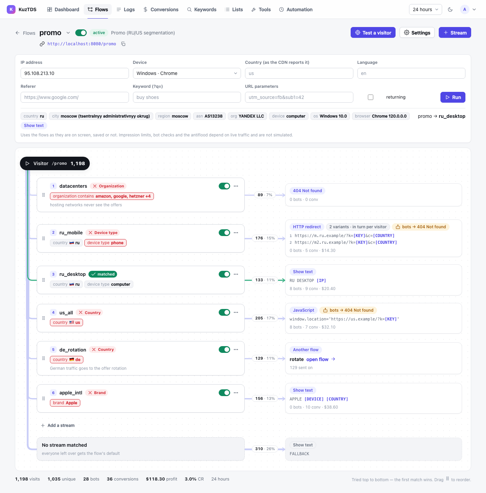
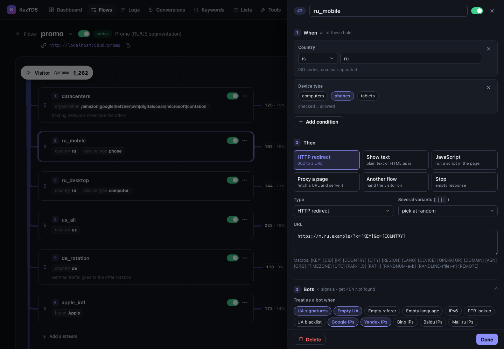
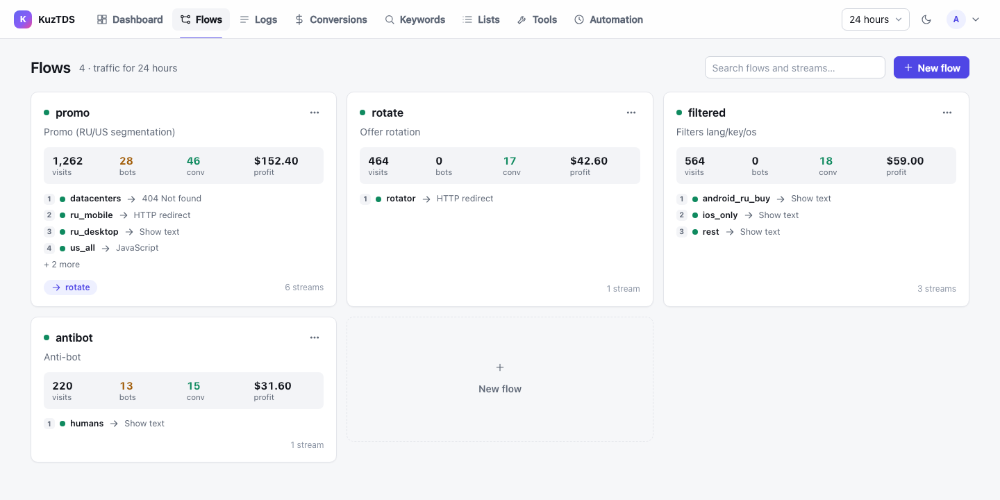
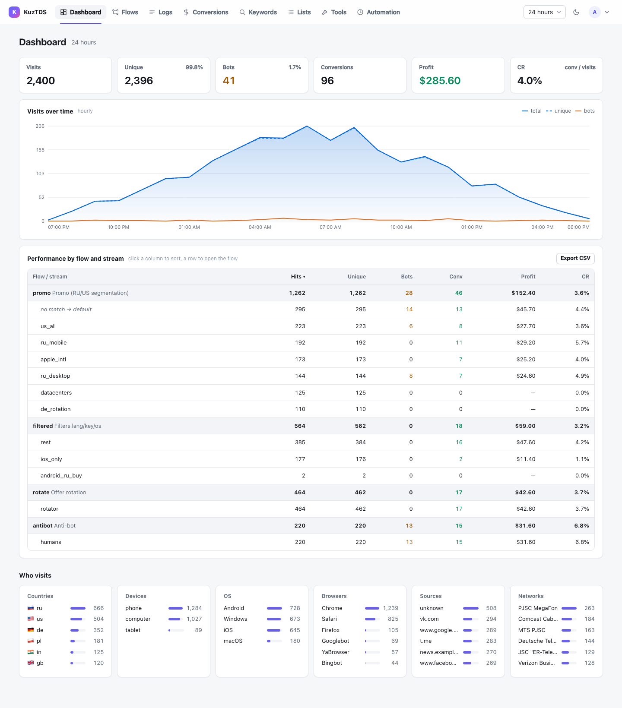
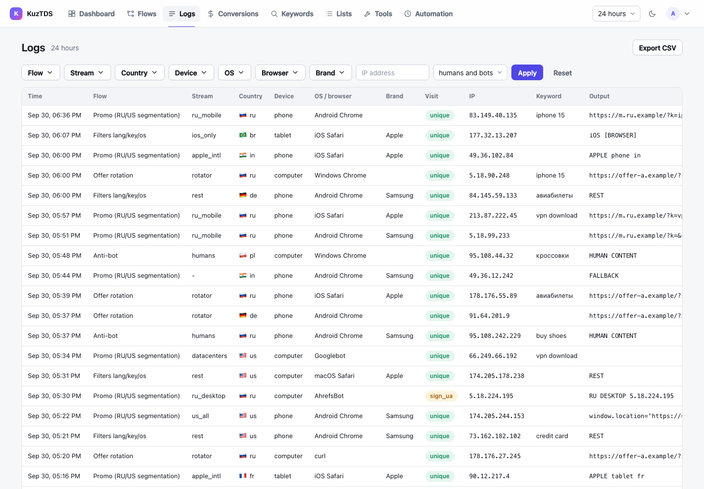
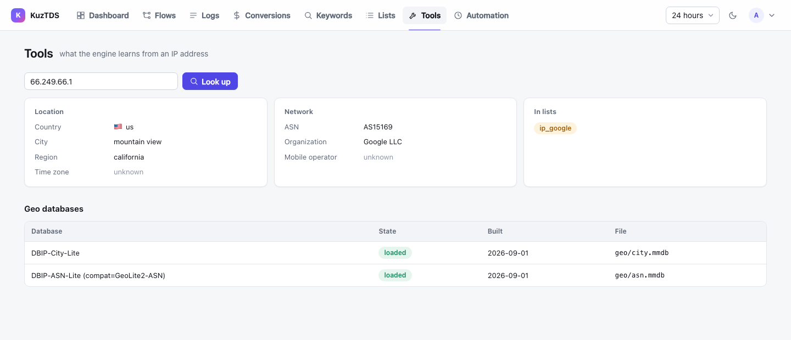
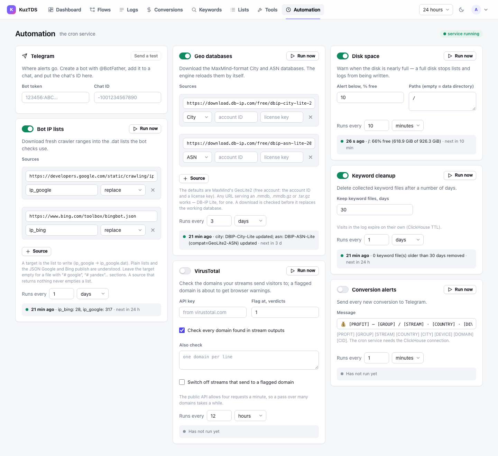
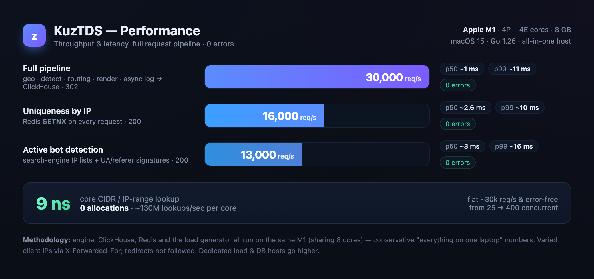
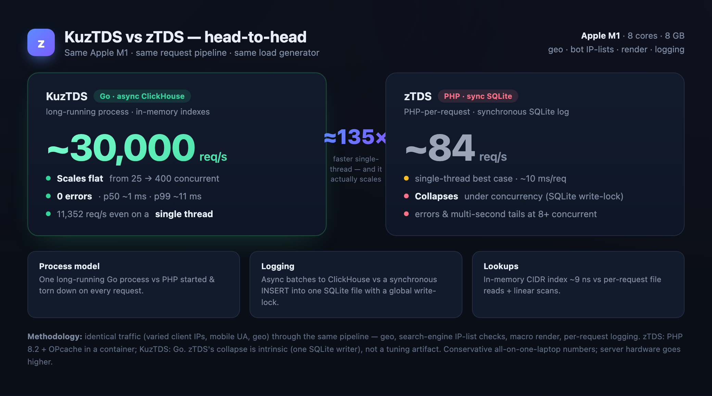

**English** · [Русский](README.ru.md)

# KuzTDS

[](https://github.com/egerkuzma/kuztds/actions/workflows/ci.yml)
[](https://goreportcard.com/report/github.com/egerkuzma/kuztds)
[](go.mod)
[](LICENSE)

**A fast, secure, self-hosted Traffic Distribution System (TDS) written in Go.**

KuzTDS takes an incoming visitor, decides **by rules** where to send them
(redirect / iframe / JavaScript / inline content / stub), tells **bots apart from
humans**, and records everything for analytics — a single long-running engine,
an admin panel embedded in its own binary, and a small background service that
keeps the lists and geo databases fresh.

It is built for throughput and safety: IP lists and signatures live in memory
(`O(log n)` lookups), logs and conversions go to **ClickHouse**, counters and
sessions go to **Redis**, and the response never waits for a log write.



---

## Table of contents

- [Why KuzTDS](#why-kuztds)
- [Features](#features)
- [Screenshots](#screenshots)
- [Architecture](#architecture)
- [Performance](#performance)
- [Benchmark vs zTDS](#benchmark-vs-ztds)
- [Quick start](#quick-start)
- [Configuration](#configuration)
- [Core concepts](#core-concepts)
- [Filters and flag semantics](#filters-and-flag-semantics)
- [Output: redirect types & macros](#output-redirect-types--macros)
- [Bot detection](#bot-detection)
- [Postback & API mode](#postback--api-mode)
- [Admin web interface](#admin-web-interface)
- [HTTP endpoints](#http-endpoints)
- [Testing](#testing)
- [Project layout](#project-layout)
- [Security](#security)
- [Roadmap](#roadmap)
- [License](#license)

---

## Why KuzTDS

A TDS sits in front of your offers and landings and routes every click to the
right place based on who the visitor is. **KuzTDS does it like infrastructure —
not like a script.**

- ⚡ **Blazing fast** — **~30,000 req/s** through the *full* pipeline on a single
  laptop-class M1, p50 ~1 ms, **0 errors**. The core IP lookup is **~9 ns** with
  zero allocations.
- 📈 **Scales instead of melting** — flat throughput and zero errors from 25 to
  400 concurrent connections. In a head-to-head benchmark it is **~135× faster**
  than a classic PHP TDS — which *collapses* under the very same load.
- 🧠 **Everything in memory** — IP lists, group config, signatures and geo live in
  one long-running process; logs are written **asynchronously** to ClickHouse, so
  the hot path never blocks on disk.
- 🛡️ **Secure by default** — argon2id passwords, server-side sessions, CSRF,
  parameterized queries, `X-Forwarded-For` and `CF-IPCountry` believed only
  from trusted proxies, JSON-only input.
- 🎛️ **Batteries included** — a polished, **embedded** admin panel: flows drawn
  as they work (drag streams to reorder, line widths follow the traffic),
  conditions and outputs shown as words and rows instead of `|`-separated
  strings, a visitor test that shows which rule stopped whom, dashboard, logs,
  conversions, `.dat` editor, automation. No Node build, no separate web server.
- 🕒 **A background service** — `cmd/cron` keeps bot IP lists and geo databases
  fresh, checks your domains with VirusTotal, watches the disk and reports
  conversions to Telegram.
- 🧩 **One binary, optional deps** — ClickHouse and Redis are optional; the engine
  runs without them and simply skips the corresponding features.
- ✅ **Genuinely tested** — unit tests + **23 end-to-end scenarios** + ClickHouse
  integration + an embedded-JS syntax check, all green in CI.
- 🆓 **Open source (MIT)** — self-hosted and fully yours to run, modify and ship.

> **The short version:** a modern, in-memory, single-binary TDS that stays fast
> and predictable exactly where older PHP-based systems fall over.

---

## Features

**Traffic segmentation (per stream):**
- Geo: country / city / region / **time zone** (MaxMind-format `.mmdb`, or the
  CDN's `CF-IPCountry` for the country).
- Network: **ASN** and **organization** (from an ASN `.mmdb`) — e.g. keep
  hosting networks away from an offer.
- Device: computer / phone / tablet.
- OS, browser (+ versions), device brand (Apple, Samsung, Xiaomi, …).
- WAP carrier (operator) by IP ranges from `wap.dat`.
- Language, referer, domain, keyword (`?q=`), any **URL parameter**
  (`utm_source=fb`), and arbitrary IP lists.
- Yandex.Browser, uniqueness, referer presence.
- Weekly schedule (per day of week).
- Per-stream impression limits (per day / per rolling window).

**Bot handling:**
- UA/referer signatures, search-engine IP lists (Google/Bing/Yandex/Yahoo/Mail/
  Baidu/Others), empty UA/referer/language, IPv6, reverse DNS (PTR), UA blacklist.
- Bots are detected **after** stream selection (per the chosen stream's toggles).
- Optional separate output for bots (`bot_redirect`), or `skip` to serve them the
  normal stream while still logging them.
- `save_ip`: append a detected search-engine IP back into its list.

**Output & rendering:**
- 18 redirect types (HTTP redirect, JS, meta refresh, iframe, inline HTML, error
  pages, JSON API responses, stub, …) — including **`group`: hand the visitor
  to another group**, so flows can be chained.
- A rich macro set: `[KEY] [IP] [COUNTRY] [CITY] [REGION] [LANG] [DEVICE]
  [OPERATOR] [DOMAIN] [USERAGENT] [CID] [ASN] [ORG] [TIMEZONE] [UTC]
  [PAR-1..5] [()COUNTRY()] [()CITY()]
  [RANDNUM-a-b] [RANDSTR-(set)-n] [RANDLINE-(file)-n] [RANDDFL-(dir)-n]`.
- Output-variant distribution with `|||`: `random` / `rotator` (cookie) /
  `evenly` (Redis counter).
- `chance` (show with probability), `separation` (swap output by keyword from a
  `.dat`), `[REMOTE]` (fetch external content with caching), CURL redirect
  (fetch + find/replace), `api_mac` (mac code in API responses).

**Operations:**
- Group config, IP lists, separation lists, bot signatures and the geo
  databases are re-read in the background when their files change — admin
  edits and fresh downloads go live without restarting the engine.
- The **cron service** (`cmd/cron`): bot IP lists from URLs (incl. the JSON
  Google and Bing publish), MaxMind-format database downloads, VirusTotal
  checks of the domains streams send to, free-disk alerts, keyword-file
  cleanup, Telegram notifications for all of it and for new conversions.
- A malformed or missing config is skipped and retried, leaving the running
  rules in place.

**Uniqueness & protection:**
- Uniqueness by IP (Redis) or by cookie (dedicated cookie, correct TTL).
- Anti-flood (max requests per IP per window).
- Login rate-limit (Redis, fixed window per IP).

**Analytics & admin:**
- **Flows**: every group drawn as a trunk with a branch per stream, widths
  following the traffic; drag to reorder; edit in a drawer; send a stream on
  to another flow; **test a visitor** and see which condition stopped them.
- Dashboard: KPI tiles (visits, unique, bots, conversions, profit, CR), a time
  chart, a **performance table by flow and stream** (hits / unique / bots /
  conversions / profit / CR, sortable, CSV) and breakdowns (country/device/OS/
  browser/source/network).
- Logs with multi-select filters loaded from real data, IP search, CSV export,
  country flags, and a detail view per visit (network, User-Agent, referer).
- Conversions (postbacks), collected keywords, `.dat` list editor, an IP
  lookup tool, the automation page, password change. Light and dark theme.

---

## Screenshots

All taken from a running stack with generated traffic.

**A flow** — the group as it works. Visitors enter at the top and fall down the
trunk; each stream is a branch to its destination; what matches nothing ends in
the default. Line widths and the labels on them are the traffic of the selected
period. Drag a stream by its handle to change the order:


**Test a visitor** — give an IP and a device and see the way through the flow:
the matched stream in green, and on every other one the condition that turned
the visitor away. It runs on the flows as edited, before saving:



**Stream editor** (dark theme) — a drawer over the page. *When*: only the
conditions this stream uses, values as chips, more from "Add condition". *Then*:
where to send — several variants are rows — including another flow. Bots and the
rare options are folded below:



**Flows** — all of them, with the period's numbers and where they link to:



**Dashboard** — what works: visits, conversions and profit, the performance
table by flow and stream, and who the visitors are:



**Logs** — multi-select filters (values loaded from the data for the selected
period), CSV export; a row opens the visit's detail:



**Tools** — what the engine learns from an IP address: location, network, the
lists it is in, and the geo databases in use:



**Automation** — the cron service: what runs, when it last ran and what it said:



---

## Architecture

Four binaries, shared `internal/` packages:

| Binary | Port | Purpose |
|--------|------|---------|
| `cmd/engine` | `:8080` | The hot path — traffic handling. A long-running process. |
| `cmd/admin` | `:8090` | REST API + embedded admin SPA (`internal/admin/web`, `go:embed`). |
| `cmd/cron` | — | Background jobs: list and geo database updates, VirusTotal, disk, Telegram. Talks to the others through files only. |
| `cmd/apiclient` | `:9090` | Client to install on a landing/donor page (calls the engine via `?api=`). |

**Request lifecycle in the engine:**

```
HTTP request
  │
  ├─ postback?  (?pb=KEY&cid=&profit=) → record conversion, exit
  ├─ realip middleware  (trust XFF/CF only from trusted_proxies)
  ├─ api mode?  (?api=base64(JSON), checks KUZTDS_API_KEY)
  ├─ IP blacklist        → 403 if listed
  ├─ resolve group by id/alias (first path segment); none → "trash" mode
  ├─ anti-flood (Redis): N requests / IP / window
  ├─ detect device/OS/browser/brand ; geo + ASN + time zone (mmdb ;
  │  CF-IPCountry only via a trusted proxy) ; carrier (wap)
  ├─ uniqueness: cookie | Redis SETNX
  ├─ router.Select(group, visitor)  → first stream that passes all filters
  │  └─ type "group" → the same visitor through another group (max 3 hops)
  ├─ bot detection by the SELECTED stream's toggles → bot_redirect (or skip)
  ├─ separation · fetch [REMOTE] · chance · distribution (|||) · api_mac
  ├─ render: macros + redirect type (CURL = fetch+find/replace; api = JSON);
  │  the [REMOTE] body is spliced in AFTER macro expansion, never rescanned
  ├─ collect keywords (save_keys / keys_se)
  └─ async batch log → ClickHouse  (the response never waits for the write)
```

Key principles: **state lives in process memory** (IP indexes, config,
signatures, geo) and is refreshed in the background; **rules are data** (a list of
predicates evaluated in a loop); indexes are swapped **atomically** on hot-reload.
Full details: [`docs/ARCHITECTURE.md`](docs/ARCHITECTURE.md).

---

## Performance

Measured on a **base Apple M1** (4 performance + 4 efficiency cores, 8 GB RAM),
macOS 15, Go 1.26 — with the **engine, ClickHouse, Redis, and the load generator
all running on the same laptop**. They compete for the same 8 cores, so these are
deliberately conservative "everything on one machine" numbers; a dedicated load
host and separate database hosts would push them higher.

The load generator sends requests with varied client IPs (`X-Forwarded-For`), a
mobile User-Agent, and `CF-IPCountry: RU`; redirects are **not** followed, so the
engine's own response is what's measured. Every scenario runs the **full request
pipeline** (real-IP resolution → blacklist → geo → device/OS/browser/brand detect
→ uniqueness → stream routing → bot toggles → macro rendering). Logging to
ClickHouse is asynchronous and never blocks the response.



| Scenario | Requests/sec | p50 | p99 | Errors |
|---|--:|--:|--:|--:|
| **Full pipeline** · cookie uniqueness · async log → ClickHouse (302) | **~30,000** | ~1 ms | ~11 ms | 0 |
| Uniqueness by IP · Redis `SETNX` on every request (200) | ~16,000 | ~2.6 ms | ~10 ms | 0 |
| Active bot detection · search-engine IP lists + signatures (200) | ~13,000 | ~3 ms | ~16 ms | 0 |

Throughput stays flat (~30k req/s) and **error-free** as concurrency rises from 25
to 400 — latency grows but nothing drops. The hot path is allocation-light: the
core CIDR/IP-range lookup runs in **~9 ns/op with 0 allocations**
(`go test -bench=Lookup ./internal/ipindex` → ~130M lookups/sec on a single core).

> Throughput differences between rows come purely from how much work each path
> adds (a Redis round-trip per request, or several IP-list lookups for bots). On
> server-class hardware with the databases on separate hosts, expect materially
> higher numbers.

---

## Benchmark vs zTDS

To put those numbers in context, we ran KuzTDS **head-to-head against zTDS** — a
popular legacy PHP TDS — on the **same Apple M1**, through the **same request
pipeline** (geo, search-engine IP-list checks, macro rendering, per-request
logging) and the **same load generator**.



| | KuzTDS (Go) | zTDS (PHP) |
|---|--:|--:|
| Single thread | **11,352 req/s** · p50 80 µs | 84 req/s · p50 ~10 ms |
| 8 concurrent | **23,626 req/s** · 0 errors | collapses (errors, multi-second tails) |
| 50 concurrent | **27,800 req/s** · 0 errors | collapses (mostly errors) |
| Scaling | flat to 400 concurrent, **0 errors** | degrades from 2 concurrent, fails by 8 |

**KuzTDS wins decisively** — about **135× faster on a single thread**, and under
real concurrent load the gap becomes effectively unbounded: the PHP TDS simply
**stops serving**, while KuzTDS keeps scaling without a single error.

Why such a blowout? It's **architecture, not micro-optimisation**. KuzTDS keeps
**everything in memory** — IP indexes, group config, signatures, geo — inside one
long-running process, and writes logs **asynchronously** to ClickHouse, so the hot
path never blocks. Classic PHP TDS spin up a fresh process on every request, read
files from disk on every hit, and write each log line **synchronously into a
single SQLite file behind a global write-lock** — which serializes all traffic and
collapses the moment real concurrency arrives.

> **In short: everything in memory + async logging = a TDS that scales instead of
> melting under load.** This is exactly where KuzTDS is built to stay fast and
> predictable while older PHP-based systems fall over.

Methodology and caveats — see [Performance](#performance) above. These are
conservative "all on one laptop" numbers; on server hardware both the absolute
throughput and the gap grow further.

---

## Quick start

### Prerequisites
- Go (1.25+), Docker (for ClickHouse + Redis).

```bash
brew install go docker
```

### 1. Clone & start infrastructure
```bash
git clone https://github.com/egerkuzma/kuztds.git
cd kuztds
make infra-up          # ClickHouse + Redis via docker compose; schema auto-applied
```

### 2. Generate an admin password hash
```bash
go run ./cmd/admin -hash 'my-strong-password'   # prints $argon2id$...
```

### 3. Run the engine (`:8080`)
```bash
KUZTDS_DATA_DIR=./data \
KUZTDS_GROUPS_FILE=configs/groups.example.json \
KUZTDS_TRUSTED_PROXIES=127.0.0.1/32 \
KUZTDS_POSTBACK_KEY=secret KUZTDS_API_KEY=apikey \
KUZTDS_REDIS_ADDR=localhost:6379 \
KUZTDS_CLICKHOUSE_ADDR=localhost:9000 KUZTDS_CLICKHOUSE_DB=kuztds \
KUZTDS_CLICKHOUSE_USER=kuztds KUZTDS_CLICKHOUSE_PASSWORD=devpassword \
go run ./cmd/engine
```

### 4. Run the admin panel (`:8090`)
```bash
KUZTDS_ADMIN_PASSWORD_HASH='<hash-from-step-2>' \
KUZTDS_ADMIN_PASSWORD_FILE=./admin.hash \
KUZTDS_ADMIN_COOKIE_SECURE=false \
KUZTDS_ENGINE_URL=http://localhost:8080 \
KUZTDS_GROUPS_FILE=configs/groups.example.json \
KUZTDS_DATA_DIR=./data KUZTDS_KEYS_DIR=./keys \
KUZTDS_REDIS_ADDR=localhost:6379 \
KUZTDS_CLICKHOUSE_ADDR=localhost:9000 KUZTDS_CLICKHOUSE_DB=kuztds \
KUZTDS_CLICKHOUSE_USER=kuztds KUZTDS_CLICKHOUSE_PASSWORD=devpassword \
go run ./cmd/admin
```

Open **http://localhost:8090** and log in with `admin` and your password.

### 5. Run the cron service (optional)
```bash
KUZTDS_CRON_FILE=./cron.json \
KUZTDS_DATA_DIR=./data KUZTDS_KEYS_DIR=./keys \
KUZTDS_GROUPS_FILE=configs/groups.example.json \
KUZTDS_GEO_DB=./geo/city.mmdb KUZTDS_ASN_DB=./geo/asn.mmdb \
KUZTDS_CLICKHOUSE_ADDR=localhost:9000 KUZTDS_CLICKHOUSE_PASSWORD=devpassword \
go run ./cmd/cron
```
Give the engine and the admin the same `KUZTDS_GEO_DB` / `KUZTDS_ASN_DB`, and the
admin the same `KUZTDS_CRON_FILE`; then everything it does is configured on the
**Automation** page. Nothing runs until a job is switched on there.

### 6. Send a test request to the engine
```bash
curl -i 'http://localhost:8080/promo?q=hello' \
  -H 'X-Forwarded-For: 8.8.8.8' \
  -H 'User-Agent: Mozilla/5.0 (iPhone; CPU iPhone OS 16_0 like Mac OS X) Safari/604.1' \
  -H 'CF-IPCountry: US'
```
Diagnostic response headers show the decision: `X-Kuztds-Stream`, `X-Kuztds-Bot`,
`X-Kuztds-Country`, `X-Kuztds-Device`, `X-Kuztds-Uniq`.

> A `Makefile` is provided: `make build`, `make test`, `make bench`,
> `make infra-up`, `make infra-down`.

---

## Configuration

Everything is configured via `KUZTDS_*` environment variables; **secrets are never
written to files in the repo**. Full reference: [`docs/USAGE.md`](docs/USAGE.md).

### Engine (most-used)
| Variable | Purpose |
|----------|---------|
| `KUZTDS_LISTEN` | listen address (default `:8080`) |
| `KUZTDS_DATA_DIR` | directory of `.dat` lists (IP, wap, signatures, separation) |
| `KUZTDS_GROUPS_FILE` | JSON groups config (source of truth) |
| `KUZTDS_TRUSTED_PROXIES` | trusted proxy CIDRs for `XFF`/`CF` (comma-separated) |
| `KUZTDS_GEO_DB` | path to a MaxMind-format City or Country `.mmdb` (optional; without it the country comes from `CF-IPCountry`) |
| `KUZTDS_ASN_DB` | path to a MaxMind-format ASN `.mmdb` (optional; enables the ASN / organization filters) |
| `KUZTDS_RELOAD_INTERVAL` | how often changed files are re-read (default `1m`) |
| `KUZTDS_REDIS_ADDR` / `_PASSWORD` | Redis (uniq/limit/firewall) |
| `KUZTDS_CLICKHOUSE_ADDR` / `_DB` / `_USER` / `_PASSWORD` | ClickHouse (logs) |
| `KUZTDS_POSTBACK_KEY` | key for the `?pb=` postback |
| `KUZTDS_API_KEY` | key for the `?api=` client mode |
| `KUZTDS_KEYS_DIR` | directory for collected keywords |
| `KUZTDS_TRASH_MODE` / `_URL` | behaviour for an unknown group (0=200,1=redirect,2=403,3=404) |

### Shutdown budget

On `SIGTERM` the engine drains in two sequential phases, ten seconds each:
`http.Server.Shutdown` for in-flight requests, then the log buffer for events
that have not reached ClickHouse yet. **Give the process at least 25 seconds to
stop.**

The budgets are separate on purpose: sharing one deadline meant a busy server
could spend all of it and hand the log drain a context that was already dead.

Defaults are shorter than that almost everywhere — Docker stops a container
10 seconds after `SIGTERM`, and systemd's `TimeoutStopSec` is often lower than
you think. A `SIGKILL` in the middle of the drain costs the last batch of events
*and* the `engine stopped` line that reports what was lost.

```yaml
services:
  engine:
    stop_grace_period: 30s
```

```ini
[Service]
TimeoutStopSec=30
```

### Admin (most-used)
| Variable | Purpose |
|----------|---------|
| `KUZTDS_ADMIN_LISTEN` | address (default `:8090`) |
| `KUZTDS_ADMIN_USER` | login (default `admin`) |
| `KUZTDS_ADMIN_PASSWORD_HASH` | argon2id hash |
| `KUZTDS_ADMIN_PASSWORD_FILE` | hash file (takes priority; UI password changes are written here) |
| `KUZTDS_ENGINE_URL` | engine base URL (for group links in the UI) |
| `KUZTDS_GROUPS_FILE` / `KUZTDS_DATA_DIR` / `KUZTDS_KEYS_DIR` | same paths as the engine |
| `KUZTDS_GEO_DB` / `KUZTDS_ASN_DB` | same paths as the engine (IP lookup, visitor test) |
| `KUZTDS_CRON_FILE` | the cron service's config file (enables the Automation page) |

### Cron service
| Variable | Purpose |
|----------|---------|
| `KUZTDS_CRON_FILE` | its config (JSON, written by the admin; default `cron.json`). State is kept next to it in `<file>.status.json` |
| `KUZTDS_DATA_DIR` / `KUZTDS_KEYS_DIR` / `KUZTDS_GROUPS_FILE` | same paths as the engine |
| `KUZTDS_GEO_DB` / `KUZTDS_ASN_DB` | where downloaded databases are put — the config chooses what to download, never where to write |
| `KUZTDS_CLICKHOUSE_*` | only for conversion notifications |

### Groups config (JSON)
A group is reachable at `/<id>` (and at each alias). Example shape:

```json
[
  {
    "id": "promo",
    "name": "Promo (RU/US segmentation)",
    "status": true,
    "redirect": "show_text",
    "out": "FALLBACK",
    "uniq_method": "cookie",
    "uniq_seconds": 86400,
    "firewall": { "enabled": false, "queries": 100, "seconds": 60 },
    "save_keys": true,
    "aliases": ["ru"],
    "streams": [
      {
        "name": "ru_mobile",
        "status": true,
        "rules": { "country": { "flag": 2, "values": ["ru"] }, "computer": 1, "tablet": 1 },
        "out": { "redirect": "http_redirect", "out": "https://m.example.com/?k=[KEY]&c=[COUNTRY]" },
        "bots": { "ch_ua": true, "ch_empty_ua": true, "ch_bot_ip_google": true, "redirect": "404_not_found" }
      },
      {
        "name": "de_to_offers",
        "status": true,
        "comment": "German traffic goes on to the offers group",
        "rules": { "country": { "flag": 2, "values": ["de"] } },
        "out": { "redirect": "group", "out": "offers" }
      },
      { "name": "default", "status": true, "out": { "redirect": "show_text", "out": "no offer" } }
    ]
  }
]
```

`de_to_offers` hands German visitors to the group whose id is `offers` — another
entry of the same file (see *Group links* below).

You normally **edit groups in the admin UI** ("Flows" → open a flow → click a
stream → "Save"). The engine notices the file changed and swaps the config in within
`KUZTDS_RELOAD_INTERVAL` (1 min by default) — no restart. A malformed or missing
file leaves the running config untouched. See `configs/groups.example.json` and
`configs/test_groups.json`.

---

## Core concepts

- **Group** — a routing target reachable at `/<id>`; the admin panel calls it
  a **flow**. It holds defaults (`redirect`/`out`/`header`),
  uniqueness/firewall settings, and a list of **streams**.
- **Stream** — a set of **rules** (predicates) plus an **output**. The router
  picks the **first active stream that passes all of its rules**; order matters.
- **Rules are data** — each filter is a value with a flag; the router evaluates
  them in a loop. If no stream matches, the group defaults / `trash` mode apply.
- **Group links** — a stream (or a group's default) of type `group` hands the
  visitor to another group, whose streams are then tried with the same visitor.
  Chains are limited to three hops; a link to a missing or disabled group
  answers like an unknown group.
- **Trash mode** — what to return for an unknown/disabled group: `200` empty,
  redirect, `403`, or `404`.

---

## Filters and flag semantics

Most list filters use a three-state flag (the zero value is "off", so unset
filters never block traffic):

| Flag | Meaning (list filters) | Meaning (device/operator) |
|:----:|------------------------|---------------------------|
| `0` | **off** — filter not applied | — |
| `1` | **exclude** — reject on match (blacklist) | block this device/operator |
| `2` | **include** — reject on absence of a match (whitelist) | require (whitelist) |

In the UI these read **is / is not**; a condition that is not on the stream is
off. `lang`/`country` use "contains" semantics; `city`/`region`/`brand` use
exact match; `ua`/`referer`/`key`/`org` accept `/regex/` or a substring;
`os`/`browser` match over `"name version"`; `asn` takes numbers (`AS15169` or
`15169`); `timezone` takes UTC offsets (`+3`, `+5:30`) or zone names
(`Europe/Moscow`); `get` takes `name` (present) or `name=value`.

---

## Output: redirect types & macros

**Redirect types** (`out.redirect`):

| Type | Result |
|------|--------|
| `http_redirect` | `302` with `Location: <out>` |
| `meta_refresh`, `js_redirect`, `iframe_redirect`, `iframe_selection`, `js_selection` | HTML that navigates the browser |
| `javascript` | `200` JS body |
| `show_text` | `200` plain text |
| `show_page_html` | `200` HTML page wrapping `<out>` |
| `under_construction` | `200` stub page |
| `stop` | `200`, empty body |
| `403_forbidden`, `404_not_found`, `500_server_error` | error pages |
| `api` | `200` JSON `{out,type,country,device,…}` (for api clients) |
| `show_out` | `200` JSON `{out,type:1,mac}` |
| `curl` | fetch a URL server-side, apply find/replace, return the body |
| `group` | hand the visitor to the group named in `out` |

**Macros** (expanded in `out`):

`[KEY]` (url-encoded keyword) · `[PATH]` (host) · `[IP]` · `[COUNTRY]` `[CITY]`
`[REGION]` · `[ASN]` `[ORG]` (url-encoded) · `[TIMEZONE]` `[UTC]` · `[LANG]` ·
`[DEVICE]` · `[OPERATOR]` · `[DOMAIN]` · `[USERAGENT]` ·
`[CID]` (click id, for postbacks) · `[PAR-1..5]` (extra GET params) ·
`[()COUNTRY()]` `[()CITY()]` · `[RANDNUM-a-b]` · `[RANDSTR-(charset)-n]` ·
`[RANDLINE-(file)-n[/u]]` · `[RANDDFL-(dir)-n[/u]]`.

**Distribution** — put several variants in `out` separated by `|||` (in the
admin: **Add a variant** under the output) and choose `distribution`: `random`,
`rotator` (each visitor gets the next one; the position is kept in a cookie), or
`evenly` (Redis counter, round-robin for everyone).

---

## Bot detection

Per stream, toggle which checks apply (section **Bots** of the stream editor): UA/referer
signatures, empty UA/referer/language, IPv6, PTR (reverse DNS), UA blacklist, and
search-engine IP lists. Detection runs **after** stream selection. Then:

- `redirect: "skip"` (or empty) — serve the normal stream output, but still log
  the visitor as a bot.
- `redirect: "404_not_found"` (or any redirect type) + optional `out`/`header` —
  serve bots a **separate** output (`bot_redirect`).
- `save_ip: true` — append a detected search-engine IP back into its `.dat` list.

---

## Postback & API mode

**Postback (conversion tracking).** Put a click id into your offer URL via the
`[CID]` macro, then have the offer call back:

```
http://your-host/?pb=YOUR_POSTBACK_KEY&cid=[CID]&profit=1.50
```
The engine finds the original event by `cid` and records the conversion (visible
under **Conversions**).

**API mode.** A landing page can ask the engine for a decision without redirecting
the visitor itself: send `?api=base64(JSON)` (authenticated with `KUZTDS_API_KEY`)
containing the visitor data; the engine returns a JSON decision. `cmd/apiclient`
is a ready-made client that collects visitor data, calls the engine, and applies
the result (redirect or content).

---

## Admin web interface

A single embedded page (light and dark theme, English UI), no build step. One
**top bar** carries the navigation, the period picker, the theme toggle and the
user menu; there are no sidebars. Every page has an address (`#/flows/promo`),
so back/forward and links work. Whatever can be edited is compared with what
was last saved, and a bar at the bottom offers **Save** / **Discard** on any
page — drafts survive moving around the panel.

- **Dashboard** — six KPI tiles (visits, unique, bots, conversions, profit, CR),
  a time chart with hover values, the **performance table** by flow and stream
  (sortable, CSV, click to open the flow), breakdowns by country, device, OS,
  browser, source and network.
- **Flows** — cards for every group with the period's numbers. A flow's page
  draws it as it works: the entry, a **trunk** the visitors fall down, a
  **branch** per stream to its destination, the default at the bottom; widths
  and labels are the traffic of the period. Drag a stream by its handle to
  reorder, flip its switch, duplicate it or move it to another flow from its
  menu. Click a stream to edit it in a **drawer**: *When* (only the conditions
  it carries; 23 kinds behind "Add condition" — geo, time zone, ASN,
  organization, operator, IP list, device, brand, OS, browser, language,
  referer, domain, keyword, URL parameter, User-Agent, unique, days of week,
  impression limit), *Then* (type, output, variants — or another flow), *Bots*,
  *Advanced*, and a note shown on the canvas.
- **Test a visitor** (on a flow's page) — IP, device, country, language,
  referer, keyword, URL parameters → the path through the flow, the matched
  stream, and for every other stream the condition that stopped the visitor.
  Works on unsaved edits and follows links to other flows.
- **Logs** — multi-select filters whose values are loaded from the data of the
  period, IP field, humans/bots, CSV export; a row opens the visit's detail.
- **Conversions** — postbacks and total profit. **Keywords** — collected per
  flow and day. **Lists** — editor for `.dat` files.
- **Tools** — what the engine learns from an IP: location, network, which
  lists it is in, and the state of the geo databases.
- **Automation** — the cron service: a card per job with its switch, interval,
  settings, last result and "Run now"; Telegram with a test message.
- **Settings** (user menu) — change the admin password, switch the theme.

---

## HTTP endpoints

**Engine:**
- `GET /<id>` — serve a group (optionally `?q=<keyword>`, `?p1=..&p2=..`).
- `GET /?pb=KEY&cid=..&profit=..` — postback pixel.
- `GET /?api=base64(JSON)` — api-client mode.
- `GET /healthz` — health probe. The body stays `ok`; the number of log events
  that never reached ClickHouse rides along in headers, so it can be scraped
  without a metrics endpoint: `X-Events-Lost: <total>` and
  `X-Events-Lost-Detail: full=<n> queue=<n> insert=<n> late=<n>` (the intake
  channel was full / the batch queue was full / the insert failed / the event
  arrived during shutdown). The same counters are logged on exit.

**Admin API** (`GET /api/health` is open; the rest is session + CSRF protected):
`POST /api/login`, `POST /api/logout`,
`GET /api/me`, `POST /api/password`, `GET /api/stats/{summary,timeseries,
breakdown,performance}`, `GET /api/logs`, `GET /api/logs/filters`, `GET /api/logs/export`,
`DELETE /api/logs`, `GET /api/postbacks`, `GET /api/keys`,
`GET|PUT /api/groups`, `GET /api/lists`, `GET|PUT /api/lists/{name}`,
`GET /api/lookup`, `POST /api/simulate`, `GET|PUT /api/cron`, `POST /api/cron/run`.

---

## Testing

```bash
go test ./...                              # unit tests (16 packages)
go test -tags=integration ./...            # + ClickHouse/Redis round-trips (needs make infra-up)
go test -tags=uitest ./internal/admin/     # the embedded SPA: its JS parses, its value conversions hold (needs node)
go vet ./...
make bench                                 # ipindex (~10 ns/lookup) and geo lookup benchmarks
```

Highlights: `cmd/engine/e2e_test.go` drives **23 end-to-end scenarios** through
the full pipeline (all redirect types, all macros, bots, geo, filters, operators,
distribution, limits, firewall, separation, schedule, chance, api mode, and a
traffic matrix). `internal/cron` runs every job against local HTTP servers —
downloads in all formats, refusals of bad ones, alerts, the schedule.
`internal/admin/web_logic_test.go` runs the admin's value conversions under
node — word lists ↔ regular expressions, flags, output variants — so what the
editor shows is saved back exactly. ClickHouse tests are behind the `integration` build tag and skip
automatically when ClickHouse is unavailable. Coverage snapshot:
[`docs/STATUS.md`](docs/STATUS.md).

---

## Project layout

```
cmd/
  engine/       hot path (traffic handling)
  admin/        REST API + embedded SPA
  cron/         background service
  apiclient/    landing/donor client
internal/
  ipindex/      CIDR index O(log n) + list manager with hot-reload
  config/       group/stream model + JSON loader (hot-reload)
  seplist/      separation lists in memory (hot-reload)
  geo/          MaxMind-format databases (City/Country + ASN), hot-reloaded
  cron/         the background jobs and their config
  atomicfile/   write-then-rename
  detect/       device + OS/browser/brand + bots, signatures
  router/       stream selection (predicates)
  render/       output macros + all redirect types
  fetch/        HTTP client with TTL cache ([REMOTE], CURL)
  store/        ClickHouse (logs/postbacks/stats) + Redis (counters/sessions)
  logbuf/       async event buffer → batch insert
  security/     argon2id, sessions, CSRF, constant-time
  server/       realip middleware (trusted proxies)
  admin/        HTTP handlers, file stores, embedded SPA (web/index.html)
migrations/clickhouse/   schema (auto-applied by make infra-up)
deploy/docker-compose.yml ClickHouse + Redis for local dev
configs/                 example & test group configs
docs/                    USAGE / ARCHITECTURE / SECURITY / STATUS (+ *.ru.md)
```

---

## Security

argon2id passwords · server-side sessions · CSRF on unsafe methods · login
rate-limit · trusted-proxy handling for XFF **and** `CF-IPCountry` ·
parameterized ClickHouse queries ·
strict `.dat` filename validation (no path traversal) · JSON-only input · secrets
via env only. Full model: [`docs/SECURITY.md`](docs/SECURITY.md).

---

## Roadmap

Not done yet: a second factor (TOTP) for the admin login, a settings page for
the api client, a fourth device category (Smart TV), version ranges in OS /
browser filters. See [`TODO.md`](TODO.md).

---

## License

[MIT](LICENSE).
