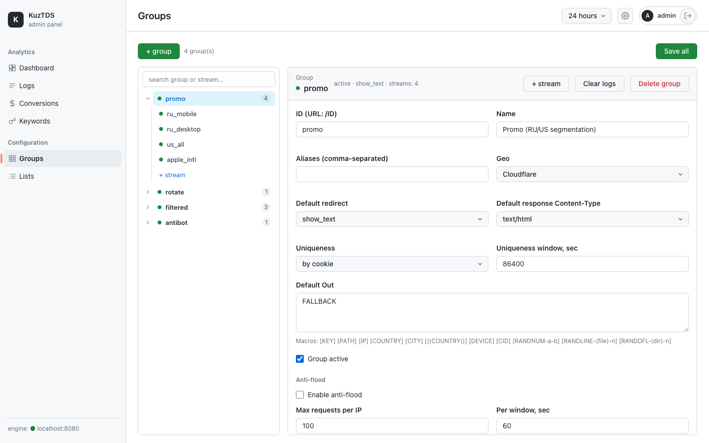
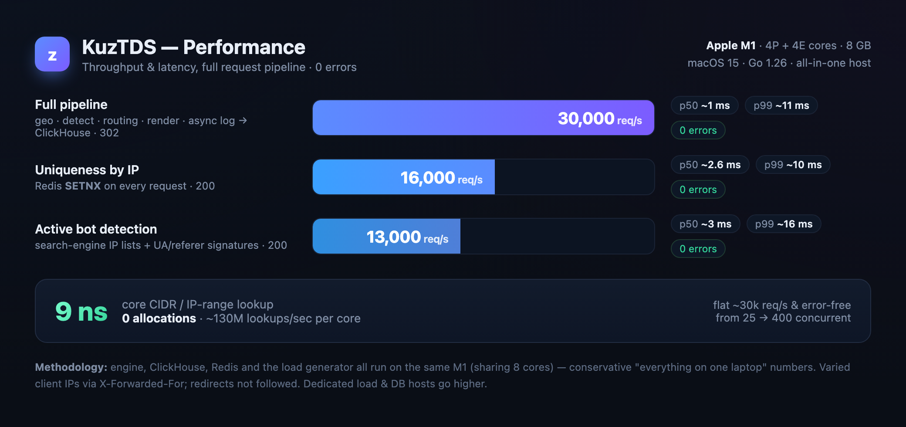
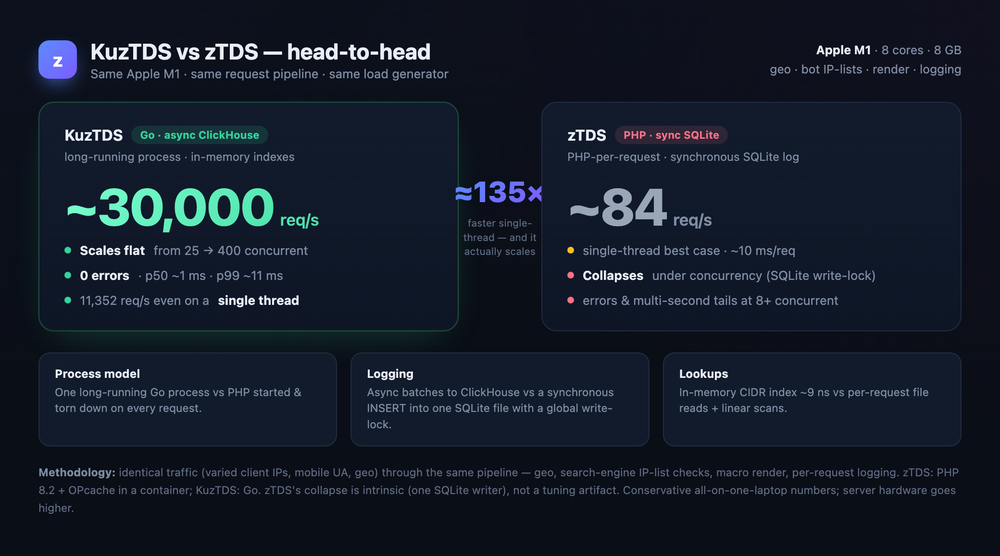

[English](README.md) · **Русский**

# KuzTDS

[](https://github.com/egerkuzma/kuztds/actions/workflows/ci.yml)
[](https://goreportcard.com/report/github.com/egerkuzma/kuztds)
[](go.mod)
[](LICENSE)

**Быстрая, безопасная, self-hosted система распределения трафика (TDS) на Go.**

KuzTDS принимает входящего посетителя, **по правилам** решает, куда его направить
(редирект / iframe / JavaScript / контент / заглушка), отделяет **ботов от людей**
и пишет всё для аналитики — из одного долгоживущего бинарника со встроенной
админ-панелью.

Сделан ради скорости и безопасности: IP-списки и сигнатуры держатся в памяти
(поиск `O(log n)`), логи и конверсии идут в **ClickHouse**, счётчики и сессии — в
**Redis**, а ответ никогда не ждёт записи лога.


---

## Содержание

- [Зачем KuzTDS](#зачем-kuztds)
- [Возможности](#возможности)
- [Скриншоты](#скриншоты)
- [Архитектура](#архитектура)
- [Производительность](#производительность)
- [Сравнение с zTDS](#сравнение-с-ztds)
- [Быстрый старт](#быстрый-старт)
- [Конфигурация](#конфигурация)
- [Основные понятия](#основные-понятия)
- [Фильтры и семантика флагов](#фильтры-и-семантика-флагов)
- [Вывод: типы редиректа и макросы](#вывод-типы-редиректа-и-макросы)
- [Детект ботов](#детект-ботов)
- [Постбэк и API-режим](#постбэк-и-api-режим)
- [Веб-интерфейс админки](#веб-интерфейс-админки)
- [HTTP-эндпоинты](#http-эндпоинты)
- [Тестирование](#тестирование)
- [Структура проекта](#структура-проекта)
- [Безопасность](#безопасность)
- [Планы](#планы)
- [Лицензия](#лицензия)

---

## Зачем KuzTDS

TDS стоит перед твоими офферами и лендингами и направляет каждый клик в нужное
место в зависимости от того, кто пришёл. **KuzTDS делает это как инфраструктура —
а не как скрипт.**

- ⚡ **Очень быстрый** — **~30 000 req/s** через *полный* конвейер на одном
  ноутбучном M1, p50 ~1 мс, **0 ошибок**. Ядро поиска по IP — **~9 нс** при нуле
  аллокаций.
- 📈 **Масштабируется, а не плавится** — ровная пропускная и ноль ошибок при росте
  с 25 до 400 параллельных соединений. В прямом сравнении он **~в 135 раз
  быстрее** классического PHP-TDS, который под той же нагрузкой *обрушивается*.
- 🧠 **Всё в памяти** — IP-списки, конфиг групп, сигнатуры и гео живут в одном
  долгоживущем процессе; логи пишутся **асинхронно** в ClickHouse, поэтому горячий
  путь никогда не упирается в диск.
- 🛡️ **Безопасный из коробки** — argon2id-пароли, серверные сессии, CSRF,
  параметризованные запросы, доверенные прокси для `X-Forwarded-For`, только JSON.
- 🎛️ **Всё в комплекте** — отполированная **встроенная** админка (дашборд, логи с
  фильтрами из данных, конверсии, редактор групп/потоков, редактор `.dat`). Без
  сборки на Node и без отдельного веб-сервера.
- 🧩 **Один бинарник, зависимости опциональны** — ClickHouse и Redis не
  обязательны; движок работает и без них, просто пропуская соответствующие функции.
- ✅ **По-настоящему протестирован** — юнит-тесты + **23 сквозных сценария** +
  интеграция с ClickHouse + проверка синтаксиса встроенного JS, всё зелёное в CI.
- 🆓 **Open source (MIT)** — self-hosted и полностью твой: запускай, меняй,
  выкатывай.

> **Если коротко:** современный TDS «всё в памяти», один бинарник, который
> остаётся быстрым и предсказуемым ровно там, где старые системы на PHP отваливаются.

---

## Возможности

**Сегментация трафика (по потокам):**
- Гео: страна / город / регион (MaxMind `.mmdb` или Cloudflare `CF-IPCountry`).
- Устройство: компьютер / телефон / планшет.
- ОС, браузер (+ версии), бренд устройства (Apple, Samsung, Xiaomi, …).
- WAP-оператор по диапазонам IP из `wap.dat`.
- Язык, реферер, домен, ключевое слово (`?q=`), произвольные IP-списки.
- Яндекс.Браузер, уникальность, наличие реферера.
- Расписание по дням недели.
- Лимиты показов потока (в сутки / за скользящее окно).

**Работа с ботами:**
- Сигнатуры UA/referer, IP-списки поисковиков (Google/Bing/Yandex/Yahoo/Mail/
  Baidu/Others), пустые UA/referer/язык, IPv6, обратный DNS (PTR), UA-блэклист.
- Боты определяются **после** выбора потока (по тогглам выбранного потока).
- Опциональная отдельная отдача ботам (`bot_redirect`) или `skip` — отдать им
  обычный поток, но залогировать как бота.
- `save_ip`: дописать найденный IP поисковика обратно в его список.

**Вывод и рендер:**
- 16 типов редиректа (HTTP-редирект, JS, meta refresh, iframe, инлайн-HTML,
  страницы ошибок, JSON-ответы для API, заглушка, …).
- Богатый набор макросов: `[KEY] [IP] [COUNTRY] [CITY] [REGION] [LANG] [DEVICE]
  [OPERATOR] [DOMAIN] [USERAGENT] [CID] [PAR-1..5] [()COUNTRY()] [()CITY()]
  [RANDNUM-a-b] [RANDSTR-(set)-n] [RANDLINE-(file)-n] [RANDDFL-(dir)-n]`.
- Распределение вариантов через `|||`: `random` / `rotator` (cookie) / `evenly`
  (Redis-счётчик).
- `chance` (показ с вероятностью), `separation` (подмена вывода по ключу из
  `.dat`), `[REMOTE]` (подгрузка внешнего контента с кэшем), CURL-редирект
  (загрузка + find/replace), `api_mac` (mac-код в ответах API).

**Уникальность и защита:**
- Уникальность по IP (Redis) или по cookie (выделенная cookie, корректный TTL).
- Антифлуд (макс. запросов с IP за окно).
- Rate-limit логина (Redis sliding window).

**Аналитика и админка:**
- Дашборд с графиком и разбивками (страна/устройство/ОС/браузер/бренд/группа/
  источник).
- Логи с мультиселект-фильтрами по реальным данным, поиском по IP, экспортом CSV
  и флагами стран.
- Конверсии (постбэки), собранные ключевые слова, редактор групп/потоков,
  редактор `.dat`-списков, смена пароля.

---

## Скриншоты

**Логи** — мультиселект-фильтры (значения подгружаются из данных за выбранный
период), поиск внутри списка, флаги стран, экспорт CSV, пагинация:


**Группы и потоки** — редактор мастер-детейл. Выбор потока в дереве подменяет
правую панель на месте; обе панели скроллятся сами по себе, поэтому страница не
двигается и форма всегда открывается там же:


Выбор самой группы показывает форму группы — настройки, антифлуд, обзор её
потоков и живые ссылки, которые отдаёт движок:



---

## Архитектура

Три бинарника, общие пакеты в `internal/`:

| Бинарник | Порт | Назначение |
|----------|------|------------|
| `cmd/engine` | `:8080` | Горячий путь — обработка трафика. Долгоживущий процесс. |
| `cmd/admin` | `:8090` | REST API + встроенный SPA админки (`internal/admin/web`, `go:embed`). |
| `cmd/apiclient` | `:9090` | Клиент для установки на лендинг/донор (зовёт движок через `?api=`). |

**Жизненный цикл запроса в движке:**

```
HTTP-запрос
  │
  ├─ постбэк?  (?pb=KEY&cid=&profit=) → записать конверсию, выход
  ├─ realip middleware  (доверять XFF/CF только от trusted_proxies)
  ├─ api-режим?  (?api=base64(JSON), проверка KUZTDS_API_KEY)
  ├─ IP-блэклист        → 403, если в списке
  ├─ группа по id/алиасу (первый сегмент пути); нет → режим «trash»
  ├─ антифлуд (Redis): N запросов / IP / окно
  ├─ детект устройства/ОС/браузера/бренда ; гео (mmdb / CF-IPCountry) ; оператор (wap)
  ├─ уникальность: cookie | Redis SETNX
  ├─ router.Select(group, visitor)  → первый поток, прошедший все фильтры
  ├─ детект ботов по тогглам ВЫБРАННОГО потока → bot_redirect (или skip)
  ├─ separation · [REMOTE] · chance · распределение (|||) · api_mac
  ├─ рендер: макросы + тип редиректа (CURL = загрузка+find/replace; api = JSON)
  ├─ сбор ключевых слов (save_keys / keys_se)
  └─ async-батч лог → ClickHouse  (ответ никогда не ждёт записи)
```

Ключевые принципы: **состояние в памяти процесса** (IP-индексы, конфиг,
сигнатуры, гео), обновляется в фоне; **правила — это данные** (список предикатов
в цикле); индексы при hot-reload меняются **атомарно**. Подробнее:
[`docs/ARCHITECTURE.ru.md`](docs/ARCHITECTURE.ru.md).

---

## Производительность

Замерено на **базовом Apple M1** (4 производительных + 4 энергоэффективных ядра,
8 ГБ RAM), macOS 15, Go 1.26 — при этом **движок, ClickHouse, Redis и генератор
нагрузки работают на одном ноутбуке**. Они делят одни и те же 8 ядер, поэтому это
намеренно консервативные цифры «всё на одной машине»; отдельный хост под нагрузку
и вынесенные БД дали бы выше.

Генератор шлёт запросы с разными IP клиента (`X-Forwarded-For`), мобильным
User-Agent и `CF-IPCountry: RU`; редиректы **не** прослеживаются — меряется
собственный ответ движка. Каждый сценарий проходит **полный конвейер** (резолв
реального IP → блэклист → гео → детект устройства/ОС/браузера/бренда →
уникальность → выбор потока → тогглы ботов → рендер макросов). Логирование в
ClickHouse асинхронное и никогда не блокирует ответ.



| Сценарий | Запросов/с | p50 | p99 | Ошибки |
|---|--:|--:|--:|--:|
| **Полный конвейер** · уник. по cookie · async-лог → ClickHouse (302) | **~30 000** | ~1 мс | ~11 мс | 0 |
| Уникальность по IP · Redis `SETNX` на каждый запрос (200) | ~16 000 | ~2.6 мс | ~10 мс | 0 |
| Активный детект ботов · IP-списки поисковиков + сигнатуры (200) | ~13 000 | ~3 мс | ~16 мс | 0 |

Пропускная способность держится ровно (~30k req/s) и **без ошибок** при росте
concurrency с 25 до 400 — latency растёт, но ничего не отваливается. Горячий путь
почти без аллокаций: ядро поиска по CIDR/диапазонам IP работает за **~9 нс/оп при
0 аллокаций** (`go test -bench=Lookup ./internal/ipindex` → ~130M поисков/с на
одном ядре).

> Разница в RPS между строками — чисто из-за объёма работы на пути (round-trip в
> Redis на запрос или несколько lookups по IP-спискам для ботов). На серверном
> железе с вынесенными БД цифры заметно выше.

---

## Сравнение с zTDS

Чтобы эти цифры были предметными, мы прогнали KuzTDS **лоб в лоб против zTDS** —
популярного легаси PHP-TDS — на **том же Apple M1**, через **тот же конвейер**
(гео, проверка по IP-спискам поисковиков, рендер макросов, запись лога на каждый
запрос) и **тем же генератором нагрузки**.



| | KuzTDS (Go) | zTDS (PHP) |
|---|--:|--:|
| 1 поток | **11 352 req/s** · p50 80 µs | 84 req/s · p50 ~10 мс |
| 8 параллельно | **23 626 req/s** · 0 ошибок | коллапс (ошибки, секундные хвосты) |
| 50 параллельно | **27 800 req/s** · 0 ошибок | коллапс (в основном ошибки) |
| Масштабирование | ровно до 400 параллельных, **0 ошибок** | деградирует с 2, отказ к 8 |

**KuzTDS побеждает разгромно** — примерно в **135 раз быстрее на одном потоке**, а
под реальной параллельной нагрузкой разрыв становится фактически безграничным:
PHP-TDS просто **перестаёт обслуживать**, тогда как KuzTDS продолжает
масштабироваться без единой ошибки.

Почему такой разнос? Это **архитектура, а не микрооптимизации**. KuzTDS держит
**всё в памяти** — IP-индексы, конфиг групп, сигнатуры, гео — в одном
долгоживущем процессе и пишет логи **асинхронно** в ClickHouse, поэтому горячий
путь никогда не блокируется. Классические PHP-TDS поднимают новый процесс на
**каждый** запрос, читают файлы с диска на каждом хите и пишут каждую строку лога
**синхронно в одну SQLite-базу за глобальным write-lock** — это сериализует весь
трафик и обрушивает систему, как только приходит настоящая параллель.

> **Коротко: всё в памяти + асинхронное логирование = TDS, который масштабируется,
> а не плавится под нагрузкой.** Именно здесь KuzTDS остаётся быстрым и
> предсказуемым там, где старые системы на PHP отваливаются.

Методология и оговорки — см. [Производительность](#производительность) выше. Это
консервативные цифры «всё на одном ноуте»; на серверном железе и абсолютная
пропускная, и разрыв ещё больше.

---

## Быстрый старт

### Требования
- Go (1.25+), Docker (для ClickHouse + Redis).

```bash
brew install go docker
```

### 1. Клонировать и поднять инфраструктуру
```bash
git clone https://github.com/egerkuzma/kuztds.git
cd kuztds
make infra-up          # ClickHouse + Redis через docker compose; схема применяется автоматически
```

### 2. Сгенерировать хэш пароля админки
```bash
go run ./cmd/admin -hash 'мой-надёжный-пароль'   # выведет $argon2id$...
```

### 3. Запустить движок (`:8080`)
```bash
KUZTDS_DATA_DIR=./data \
KUZTDS_GROUPS_FILE=configs/groups.example.json \
KUZTDS_TRUSTED_PROXIES=127.0.0.1/32 \
KUZTDS_POSTBACK_KEY=secret KUZTDS_API_KEY=apikey \
KUZTDS_REDIS_ADDR=localhost:6379 \
KUZTDS_CLICKHOUSE_ADDR=localhost:9000 KUZTDS_CLICKHOUSE_DB=kuztds \
KUZTDS_CLICKHOUSE_USER=kuztds KUZTDS_CLICKHOUSE_PASSWORD=devpassword \
go run ./cmd/engine
```

### 4. Запустить админку (`:8090`)
```bash
KUZTDS_ADMIN_PASSWORD_HASH='<хэш-из-шага-2>' \
KUZTDS_ADMIN_PASSWORD_FILE=./admin.hash \
KUZTDS_ADMIN_COOKIE_SECURE=false \
KUZTDS_ENGINE_URL=http://localhost:8080 \
KUZTDS_GROUPS_FILE=configs/groups.example.json \
KUZTDS_DATA_DIR=./data KUZTDS_KEYS_DIR=./keys \
KUZTDS_REDIS_ADDR=localhost:6379 \
KUZTDS_CLICKHOUSE_ADDR=localhost:9000 KUZTDS_CLICKHOUSE_DB=kuztds \
KUZTDS_CLICKHOUSE_USER=kuztds KUZTDS_CLICKHOUSE_PASSWORD=devpassword \
go run ./cmd/admin
```

Открой **http://localhost:8090** и войди как `admin` со своим паролем.

### 5. Отправить тестовый запрос на движок
```bash
curl -i 'http://localhost:8080/promo?q=hello' \
  -H 'X-Forwarded-For: 8.8.8.8' \
  -H 'User-Agent: Mozilla/5.0 (iPhone; CPU iPhone OS 16_0 like Mac OS X) Safari/604.1' \
  -H 'CF-IPCountry: US'
```
Диагностические заголовки ответа показывают решение: `X-Kuztds-Stream`,
`X-Kuztds-Bot`, `X-Kuztds-Country`, `X-Kuztds-Device`, `X-Kuztds-Uniq`.

> Есть `Makefile`: `make build`, `make test`, `make bench`, `make infra-up`,
> `make infra-down`.

---

## Конфигурация

Всё настраивается через переменные окружения `KUZTDS_*`; **секреты никогда не
пишутся в файлы в репозитории**. Полный справочник: [`docs/USAGE.ru.md`](docs/USAGE.ru.md).

### Движок (основное)
| Переменная | Назначение |
|------------|-----------|
| `KUZTDS_LISTEN` | адрес прослушивания (по умолчанию `:8080`) |
| `KUZTDS_DATA_DIR` | каталог `.dat`-списков (IP, wap, сигнатуры, separation) |
| `KUZTDS_GROUPS_FILE` | JSON-конфиг групп (источник истины) |
| `KUZTDS_TRUSTED_PROXIES` | CIDR доверенных прокси для `XFF`/`CF` (через запятую) |
| `KUZTDS_GEO_DB` | путь к MaxMind `.mmdb` (опц.; иначе `CF-IPCountry`) |
| `KUZTDS_REDIS_ADDR` / `_PASSWORD` | Redis (uniq/limit/firewall) |
| `KUZTDS_CLICKHOUSE_ADDR` / `_DB` / `_USER` / `_PASSWORD` | ClickHouse (логи) |
| `KUZTDS_POSTBACK_KEY` | ключ для постбэка `?pb=` |
| `KUZTDS_API_KEY` | ключ для api-режима `?api=` |
| `KUZTDS_KEYS_DIR` | каталог собранных ключевых слов |
| `KUZTDS_TRASH_MODE` / `_URL` | поведение для неизвестной группы (0=200,1=redirect,2=403,3=404) |

### Админка (основное)
| Переменная | Назначение |
|------------|-----------|
| `KUZTDS_ADMIN_LISTEN` | адрес (по умолчанию `:8090`) |
| `KUZTDS_ADMIN_USER` | логин (по умолчанию `admin`) |
| `KUZTDS_ADMIN_PASSWORD_HASH` | argon2id-хэш |
| `KUZTDS_ADMIN_PASSWORD_FILE` | файл хэша (приоритетнее; смена пароля в UI пишется сюда) |
| `KUZTDS_ENGINE_URL` | базовый URL движка (для ссылок групп в UI) |
| `KUZTDS_GROUPS_FILE` / `KUZTDS_DATA_DIR` / `KUZTDS_KEYS_DIR` | те же пути, что у движка |

### Конфиг групп (JSON)
Группа доступна по `/<id>` (и по каждому алиасу). Пример структуры:

```json
[
  {
    "id": "promo",
    "name": "Promo (RU/US segmentation)",
    "status": true,
    "redirect": "show_text",
    "out": "FALLBACK",
    "uniq_method": "cookie",
    "uniq_seconds": 86400,
    "firewall": { "enabled": false, "queries": 100, "seconds": 60 },
    "save_keys": true,
    "aliases": ["ru"],
    "streams": [
      {
        "name": "ru_mobile",
        "status": true,
        "rules": { "country": { "flag": 2, "values": ["ru"] }, "computer": 1, "tablet": 1 },
        "out": { "redirect": "http_redirect", "out": "https://m.example.com/?k=[KEY]&c=[COUNTRY]" },
        "bots": { "ch_ua": true, "ch_empty_ua": true, "ch_bot_ip_google": true, "redirect": "404_not_found" }
      },
      { "name": "default", "status": true, "out": { "redirect": "show_text", "out": "no offer" } }
    ]
  }
]
```

Обычно группы **редактируются в админке** («Группы» → выбрать группу или поток →
«Save all»). Движок замечает, что файл изменился, и подменяет конфиг в течение
`KUZTDS_RELOAD_INTERVAL` (по умолчанию 1 мин) — без рестарта. Битый или пропавший
файл не трогает работающий конфиг. См. `configs/groups.example.json` и
`configs/test_groups.json`.

---

## Основные понятия

- **Группа** — цель роутинга по `/<id>`. Хранит дефолты (`redirect`/`out`/
  `header`), настройки уникальности/фаервола и список **потоков**.
- **Поток** — набор **правил** (предикатов) плюс **вывод**. Роутер выбирает
  **первый активный поток, прошедший все свои правила**; порядок важен.
- **Правила — это данные** — каждый фильтр это значение с флагом; роутер
  прогоняет их в цикле. Если ни один поток не подошёл — применяются дефолты
  группы / режим `trash`.
- **Режим trash** — что вернуть для неизвестной/выключенной группы: пустой `200`,
  редирект, `403` или `404`.

---

## Фильтры и семантика флагов

Большинство списочных фильтров — трёхзначный флаг (нулевое значение = «выключено»,
поэтому незаданные фильтры никогда не режут трафик):

| Флаг | Списочные фильтры | Устройства/операторы |
|:----:|-------------------|----------------------|
| `0` | **выключено** — фильтр не применяется | — |
| `1` | **исключать** — отказ при совпадении (чёрный список) | блокировать |
| `2` | **отбирать** — отказ при отсутствии совпадения (белый список) | требовать (белый список) |

В UI это **выключено / исключать / отбирать**. `lang`/`country` — семантика
«содержит»; `city`/`region`/`brand` — точное совпадение; `ua`/`referer`/`key` —
`/regex/` или подстрока; `os`/`browser` — по `"имя версия"`.

---

## Вывод: типы редиректа и макросы

**Типы редиректа** (`out.redirect`):

| Тип | Результат |
|------|-----------|
| `http_redirect` | `302` с `Location: <out>` |
| `meta_refresh`, `js_redirect`, `iframe_redirect`, `iframe_selection`, `js_selection` | HTML, который уводит браузер |
| `javascript` | `200` JS-тело |
| `show_text` | `200` текст |
| `show_page_html` | `200` HTML-страница вокруг `<out>` |
| `under_construction` | `200` страница-заглушка |
| `stop` | `200`, пустое тело |
| `403_forbidden`, `404_not_found`, `500_server_error` | страницы ошибок |
| `api` | `200` JSON `{out,type,country,device,…}` (для api-клиентов) |
| `show_out` | `200` JSON `{out,type:1,mac}` |
| `curl` | загрузить URL на сервере, применить find/replace, вернуть тело |

**Макросы** (раскрываются в `out`):

`[KEY]` (url-кодированный ключ) · `[PATH]` (хост) · `[IP]` · `[COUNTRY]` `[CITY]`
`[REGION]` · `[LANG]` · `[DEVICE]` · `[OPERATOR]` · `[DOMAIN]` · `[USERAGENT]` ·
`[CID]` (click id, для постбэков) · `[PAR-1..5]` (доп. GET-параметры) ·
`[()COUNTRY()]` `[()CITY()]` · `[RANDNUM-a-b]` · `[RANDSTR-(charset)-n]` ·
`[RANDLINE-(file)-n[/u]]` · `[RANDDFL-(dir)-n[/u]]`.

**Распределение** — положи несколько вариантов в `out` через `|||` и выбери
`distribution`: `random`, `rotator` (липкий по cookie) или `evenly` (Redis-
счётчик, по кругу).

---

## Детект ботов

Для каждого потока включаешь нужные проверки (вкладка **Bots** в редакторе):
сигнатуры UA/referer, пустые UA/referer/язык, IPv6, PTR (обратный DNS),
UA-блэклист и IP-списки поисковиков. Детект идёт **после** выбора потока. Дальше:

- `redirect: "skip"` (или пусто) — отдать вывод обычного потока, но всё равно
  залогировать как бота.
- `redirect: "404_not_found"` (или любой тип) + опц. `out`/`header` — отдать
  ботам **отдельный** вывод (`bot_redirect`).
- `save_ip: true` — дописать найденный IP поисковика обратно в его `.dat`.

---

## Постбэк и API-режим

**Постбэк (трекинг конверсий).** Положи click id в URL оффера через макрос
`[CID]`, и пусть оффер вызовет:

```
http://your-host/?pb=YOUR_POSTBACK_KEY&cid=[CID]&profit=1.50
```
Движок найдёт исходное событие по `cid` и запишет конверсию (видна в разделе
**Conversions**).

**API-режим.** Лендинг может запросить решение у движка, не редиректя посетителя
сам: отправить `?api=base64(JSON)` (с ключом `KUZTDS_API_KEY`) с данными
посетителя; движок вернёт JSON-решение. `cmd/apiclient` — готовый клиент, который
собирает данные посетителя, зовёт движок и применяет ответ (редирект или контент).

---

## Веб-интерфейс админки

Один встроенный SPA (тёмная тема, английский UI). Раскладка: **сайдбар слева**,
**справа сверху** выбор периода, шестерёнка настроек, пользователь и выход.

- **Dashboard** — карточки визиты/уникальные/боты, график по времени и разбивки
  по странам, устройствам, ОС, браузерам, брендам, группам и источникам.
- **Logs** — мультиселект-фильтры (группа/поток/страна/устройство/ОС/браузер/
  бренд), значения которых подгружаются из данных за период, поиск внутри списка,
  поле IP, переключатель люди/боты, флаги стран, пагинация, экспорт CSV.
- **Conversions** — постбэки и суммарный профит за период.
- **Keywords** — собранные ключевые слова по группе/дате.
- **Groups** — редактор мастер-детейл: слева сворачиваемое дерево группа→поток
  с поиском, справа панель, в которой открыта ровно одна форма — группы или
  потока с вкладками (Main · Devices · WAP · Geo · Filters · UA/OS/Brand ·
  Schedule · Limit · Bots · Remote · API). Обе панели скроллятся внутри себя,
  поэтому выбор потока не двигает страницу. Метка несохранённых изменений и
  `Ctrl`+`S`.
- **Lists** — редактор `.dat`-файлов (IP-базы, WAP-операторы, сигнатуры).
- **Settings** (шестерёнка) — смена пароля админки.

---

## HTTP-эндпоинты

**Движок:**
- `GET /<id>` — отдать группу (опц. `?q=<keyword>`, `?p1=..&p2=..`).
- `GET /?pb=KEY&cid=..&profit=..` — постбэк-пиксель.
- `GET /?api=base64(JSON)` — режим api-клиента.
- `GET /healthz` — health-проба.

**Admin API** (за сессией + CSRF): `POST /api/login`, `POST /api/logout`,
`GET /api/me`, `POST /api/password`, `GET /api/stats/{summary,timeseries,
breakdown}`, `GET /api/logs`, `GET /api/logs/filters`, `GET /api/logs/export`,
`DELETE /api/logs`, `GET /api/postbacks`, `GET /api/keys`,
`GET|PUT /api/groups`, `GET /api/lists`, `GET|PUT /api/lists/{name}`.

---

## Тестирование

```bash
go test ./...                              # юнит-тесты (14 пакетов)
go test -tags=integration ./...            # + round-trip ClickHouse/Redis (нужен make infra-up)
go test -tags=uitest ./internal/admin/     # проверяет, что JS встроенного SPA парсится (нужен node)
go vet ./...
make bench                                 # бенч ipindex (~10 нс/lookup)
```

Особенность: `cmd/engine/e2e_test.go` прогоняет **23 сквозных сценария** через
полный конвейер (все типы редиректа, все макросы, боты, гео, фильтры, операторы,
распределение, лимиты, фаервол, separation, расписание, chance, api-режим и
матрица трафика). ClickHouse-тесты за build-тегом `integration` и автоматически
скипаются при недоступном ClickHouse. Снимок покрытия:
[`docs/STATUS.ru.md`](docs/STATUS.ru.md).

---

## Структура проекта

```
cmd/
  engine/       горячий путь (обработка трафика)
  admin/        REST API + встроенный SPA
  apiclient/    клиент для лендинга/донора
internal/
  ipindex/      CIDR-индекс O(log n) + менеджер списков с hot-reload
  config/       модель групп/потоков + JSON-загрузчик
  geo/          MMDB (MaxMind) / Nop резолвер
  detect/       устройство + ОС/браузер/бренд + боты, сигнатуры
  router/       выбор потока (предикаты)
  render/       макросы вывода + все типы редиректа
  fetch/        HTTP-клиент с TTL-кэшем ([REMOTE], CURL)
  store/        ClickHouse (логи/постбэки/статистика) + Redis (счётчики/сессии)
  logbuf/       async-буфер событий → батч-вставка
  security/     argon2id, сессии, CSRF, constant-time
  server/       realip middleware (доверенные прокси)
  admin/        HTTP-хендлеры, файловые сторы, встроенный SPA (web/index.html)
migrations/clickhouse/   схема (применяется автоматически make infra-up)
deploy/docker-compose.yml ClickHouse + Redis для локальной разработки
configs/                 примеры и тестовые конфиги групп
docs/                    USAGE / ARCHITECTURE / SECURITY / STATUS (+ *.ru.md)
```

---

## Безопасность

argon2id-пароли · серверные сессии · CSRF на небезопасных методах · rate-limit
логина · доверенные прокси для XFF · параметризованные запросы ClickHouse ·
строгая валидация имён `.dat` (без path traversal) · только JSON на входе ·
секреты только через env. Полная модель: [`docs/SECURITY.ru.md`](docs/SECURITY.ru.md).

---

## Планы

В планах: cron-сервис (обновление IP-списков ботов, проверка доменов в
VirusTotal, мониторинг диска + Telegram-алерты), больше гео-фильтров (ASN/
организация/таймзона), Telegram-уведомления о конверсиях и др. См.
[`TODO.ru.md`](TODO.ru.md).

---

## Лицензия

[MIT](LICENSE).
